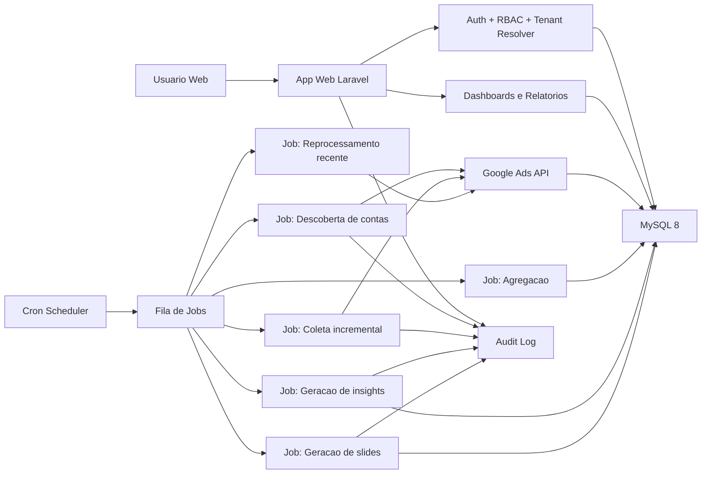

# Arquitetura SaaS Multi-tenant para Google Ads Analytics

Data de referencia: 2026-04-06

## 1. Decisao principal de arquitetura

### Escolha principal

- **Stack principal: Laravel 12 + PHP 8.3 + MySQL 8 + cron + filas + workers**
- **Modelo multi-tenant inicial: banco compartilhado com isolamento obrigatorio por `tenant_id`**
- **Hospedagem recomendada: Hostinger VPS**

### Motivo

- **PHP/Laravel encaixa melhor no ambiente Hostinger**: PHP 8.3 e cron jobs estao bem suportados. Node.js tambem existe em planos especificos, mas para este produto Laravel entrega auth server-side, jobs, scheduler e integracao com MySQL com menos atrito operacional. Para filas, workers e maior controle, **VPS e a opcao certa**.
- **Laravel reduz complexidade operacional**: autenticacao, autorizacao, filas, criptografia, logs, jobs, scheduler, CSRF e politicas de acesso ja estao maduros.
- **MySQL 8 atende o inicio**: e suficiente para facts diarias, agregacoes, auditoria e leitura rapida para dashboards. Evita custo e complexidade de um warehouse dedicado logo no inicio.
- **Banco compartilhado com `tenant_id` e o melhor equilibrio no MVP**: custo menor, deploy simples e bom desempenho. O endurecimento vem de middleware, policies, filtros obrigatorios, indices compostos e testes anti-vazamento.

### O que eu NAO recomendo para o MVP

- **Buscar metricas diretamente da Google Ads API a cada abertura de dashboard**
  - Motivo: aumenta custo, risco de throttling, latencia e indisponibilidade.
- **Node.js como stack principal na Hostinger**
  - Motivo: apesar de a Hostinger hoje oferecer suporte a Node.js em planos especificos, Laravel/PHP continua sendo a opcao mais simples e barata para este produto, principalmente por causa de cron, MySQL, auth server-side, jobs e menor atrito operacional.
- **Database-per-tenant desde o dia 1**
  - Motivo: aumenta migracoes, provisionamento, backup e operacao. Vale para clientes enterprise, nao para o MVP.

## 2. Stack recomendada para Hostinger

### MVP

- **Backend:** Laravel 12
- **Linguagem:** PHP 8.3
- **Frontend:** Blade + Livewire + Tailwind
- **Banco:** MySQL 8
- **Fila:** database queue do Laravel
- **Cache:** cache em arquivo ou banco; cache de leitura em Redis apenas se houver VPS com Redis instalado
- **Autenticacao:** sessao segura + cookies HttpOnly + CSRF
- **Slides:** geracao de PPTX com `PHPOffice/PHPPresentation`
- **Agendamento:** cron da Hostinger chamando `php artisan schedule:run`
- **Logs:** Monolog em arquivo rotativo + tabelas de auditoria no MySQL

### Recomendado

- **Hospedagem:** Hostinger VPS KVM 2 ou superior
- **Web server:** Nginx + PHP-FPM
- **Fila:** Redis + workers do Laravel
- **Supervisor de processos:** Supervisor ou systemd
- **Storage privado:** disco do VPS com pasta privada fora do publico
- **Observabilidade:** logs estruturados JSON + health checks + metricas de jobs

### Opcional

- **Frontend mais rico:** Inertia + Vue 3
- **Object storage para relatorios:** S3 compativel
- **PDF automatico:** LibreOffice headless no VPS
- **Narrativa com LLM:** somente para texto executivo, nunca para calculo das recomendacoes

### Recomendacao pratica de hospedagem

- **MVP real de producao:** Hostinger VPS
- **Nao recomendado para producao seria:** Hostinger shared/web hosting
  - Motivo: multi-tenant com filas reais, workers, retries e processamento assincrono fica limitado.

### Nota operacional importante

- Nos cron jobs gerenciados da Hostinger, a agenda em hosting gerenciado pode operar em UTC.
- Se o relatorio precisar respeitar horario local do cliente, salve timezone por tenant/cliente e converta tudo na aplicacao.
- Em VPS, prefira manter o servidor em UTC e tratar timezone no app do mesmo jeito.

## 3. Arquitetura completa do sistema

### Camadas

#### 3.1 Camada de apresentacao

- Painel web para agencia, gestores e clientes.
- Todo dashboard le do banco local.
- A interface mostra:
  - ultimo sync por conta
  - status de integracao
  - status de fila
  - confianca do insight

**Motivo:** deixa claro para o usuario que os dados sao controlados e evita expectativa de streaming em tempo real.

#### 3.2 Camada de aplicacao

Modulos:

- `Auth`
- `TenantResolver`
- `RBAC`
- `GoogleAdsConnector`
- `SyncOrchestrator`
- `AnalyticsService`
- `InsightEngine`
- `ExecutiveReportService`
- `AuditService`

**Motivo:** separa regras de negocio, reduz acoplamento e facilita testes.

#### 3.3 Camada de dados

- Tabelas transacionais: tenants, usuarios, permissoes, clientes, integracoes
- Tabelas dimensionais: contas, campanhas, grupos, palavras-chave
- Tabelas fato: metricas diarias por conta, campanha, dispositivo, regiao, horario
- Tabelas agregadas: resumos diarios/7d/30d
- Tabelas operacionais: filas, cursores, execucoes, falhas
- Tabelas de auditoria: eventos de seguranca e exportacao

**Motivo:** manter o dashboard rapido e desacoplado da API externa.

## 4. Multi-tenant real

### Tenant

- **Tenant = agencia**
- Cada tenant possui:
  - usuarios
  - clientes
  - conexoes Google Ads
  - contas Google Ads
  - targets
  - relatorios
  - insights

### Sub-isolamento dentro do tenant

- Agencia owner/admin ve tudo do tenant
- Gestor ve apenas clientes e contas atribuidos
- Analista ve leitura ou operacao limitada
- Cliente final ve somente seus dados e relatorios

### Regras obrigatorias de isolamento

- Toda tabela de negocio tem `tenant_id`
- Toda query de negocio entra por um `TenantScope`
- Chaves unicas sempre compostas por `tenant_id` quando aplicavel
- IDs externos nao sao usados sozinhos em busca de registros
- Toda leitura sensivel valida:
  - usuario autenticado
  - tenant ativo
  - permissao
  - escopo de cliente

### Nivel de isolamento por fase

- **MVP:** banco compartilhado com `tenant_id`
- **Recomendado:** criptografia por tenant para segredos
- **Opcional/enterprise:** database-per-tenant

## 5. Modelagem de banco inicial

### Entidades centrais

- `tenants`
- `users`
- `tenant_memberships`
- `clients`
- `client_access`
- `google_ads_connections`
- `google_ads_accounts`
- `dim_campaigns`
- `dim_ad_groups`
- `dim_keywords`
- `fact_google_ads_account_daily`
- `fact_google_ads_campaign_daily`
- `fact_google_ads_campaign_device_daily`
- `fact_google_ads_campaign_geo_daily`
- `fact_google_ads_campaign_hourly`
- `client_kpi_targets`
- `sync_jobs`
- `sync_cursors`
- `insight_runs`
- `insights`
- `executive_reports`
- `audit_logs`

### Grao dos fatos

- **Conta diaria**: performance consolidada por conta e data
- **Campanha diaria**: performance por campanha e data
- **Campanha x dispositivo diaria**: para recomendacao de device split
- **Campanha x regiao diaria**: para recomendacao geografia
- **Campanha x hora diaria**: para recomendacao de horario

### Motivo do grao

- Daily resolve 80% do problema com custo baixo
- Device, geo e horario sao essenciais para recomendacoes de gestor de trafego
- Keyword e search term devem entrar com parcimonia por causa de volume

### O que entra no MVP

- Conta diaria
- Campanha diaria
- Dispositivo diario
- Horario diario para contas/campanhas mais ativas
- Metadados de campanha e grupo

### O que fica para depois

- Search term detalhado
- Keyword detalhada para todos
- Asset-level reporting
- Atribuicao mais avancada

## 6. Estrategia de ingestao da Google Ads API com baixo risco

### Principio

**O dashboard nunca depende de consulta online para funcionar.**

### Fluxo de ingestao

1. Usuario conecta a conta via OAuth 2.0.
2. Sistema salva somente o refresh token criptografado.
3. Job de descoberta lista contas acessiveis e registra a hierarquia.
4. Job de backfill inicial busca historico base.
5. Scheduler passa a rodar jobs incrementais.
6. Dados vao para facts e dimensions.
7. Jobs de agregacao alimentam tabelas de leitura rapida.
8. Jobs de insight usam dados locais.

### Janela de coleta recomendada

- **Backfill inicial:** 90 dias
- **Sincronizacao frequente:** hoje e ontem em janela curta
- **Reprocessamento recente:** ultimos 7 a 14 dias
- **Reprocessamento semanal:** ultimos 30 dias para corrigir conversoes atrasadas

### Motivo

- Conversoes podem chegar depois
- Evita full refresh
- Mantem custo de API sob controle

### Estrategia de consultas

- Priorizar GAQL com poucas colunas
- Buscar apenas recursos necessarios
- Evitar segmentacoes pesadas por padrao
- Separar consultas por finalidade:
  - metadados
  - metricas diarias
  - device
  - geo
  - horario

### Uso recomendado da API

- **`SearchStream`** para cargas maiores
- **`Search`** paginado para leituras menores e debug
- **`change_status`** para descobrir recursos alterados e evitar reimportar metadados inteiros

### Regras operacionais de protecao

- 1 job ativo por conta Google Ads
- limite de concorrencia global por developer token
- cooldown por conta entre syncs
- retries maximos de 3 tentativas
- backoff exponencial em erros transientes
- circuit breaker para contas com erro repetido
- pausa automatica se houver `RESOURCE_EXHAUSTED`

### Ordem de prioridade de coleta

1. contas com relatorio agendado para o dia
2. contas com gasto recente
3. contas mais ativas
4. contas sem sync ha mais tempo

### Recursos da API que valem ouro aqui

- **`change_status`**: reduz refresh desnecessario de dimensoes
- **`segments.hour`**: permite recomendacoes de horario
- **`geographic_view`**: permite recomendacoes por regiao
- **`search_term_view` e `campaign_search_term_view`**: usar com cuidado, so quando houver beneficio claro

### O que eu recomendo NAO fazer no inicio

- puxar search terms de tudo, todo dia
- sincronizar cada clique ou cada mudanca em tempo real
- criar segmentacao muito fina para toda conta

## 7. Estrategia de seguranca

### Segredos e tokens

- `client_secret`, developer token e chaves ficam em variaveis de ambiente
- refresh tokens criptografados em repouso com AES-256-GCM
- armazenar:
  - ciphertext
  - IV/nonce
  - auth tag
  - versao da chave
- nunca salvar access token persistente se nao for necessario

### Autenticacao

- sessao de servidor
- cookie `HttpOnly`, `Secure`, `SameSite=Lax` ou `Strict`
- MFA para admins e donos de agencia
- rate limit em login, reset e export

### Autorizacao

- policies por tenant e por cliente
- acesso nunca decidido apenas por role global
- verificacao combinada:
  - tenant
  - role
  - escopo do cliente
  - acao

### Protecoes obrigatorias

- SQL Injection: ORM + query builder + queries parametrizadas
- XSS: escaping server-side e sanitizacao de campos ricos
- CSRF: token em formularios
- IDOR: toda entidade sensivel validada por `tenant_id` e permissao
- segredo no frontend: proibido
- logs com mascaramento: obrigatorio

### Auditoria

Registrar no `audit_logs`:

- login/logout
- falha de login
- convite de usuario
- alteracao de permissao
- conexao/desconexao da Google Ads
- inicio/fim/falha de sync
- exportacao gerada
- download de relatorio
- alteracao de targets
- aprovacao ou descarte de insight

### Rate limit interno

- por usuario
- por tenant
- por rota sensivel
- por tipo de operacao

Exemplos:

- login: 5 tentativas por 15 minutos por IP e email
- exportacao: 10 por hora por usuario
- gerar slides: 5 por dia por cliente
- sync manual: 1 por conta a cada 30 minutos

## 8. Modulos do sistema

### 8.1 Auth e acesso

- cadastro e convite
- login
- MFA
- sessao
- recuperacao de senha
- RBAC
- escopo por cliente

### 8.2 Tenant e clientes

- cadastro de agencia
- cadastro de clientes
- atribuicao de gestores
- KPI targets por cliente

### 8.3 Integracao Google Ads

- OAuth
- descoberta de contas
- mapeamento de MCC/login customer ID
- ativacao/desativacao de contas
- health status da integracao

### 8.4 Coleta e filas

- scheduler
- dispatcher de jobs
- cursores
- retries
- dead-letter operacional

### 8.5 Analytics

- fatos e dimensoes
- agregados 7d/30d
- comparativos de periodo
- scorecards

### 8.6 Insight engine

- regras de diagnostico
- deteccao de anomalia
- explicacoes em linguagem simples
- lista de acoes sugeridas

### 8.7 Relatorios executivos

- geracao de narrativa
- template de slides
- exportacao PPTX
- historico de relatorios

### 8.8 Auditoria e observabilidade

- trilha de auditoria
- logs tecnicos
- fila e falhas
- saude das integracoes

## 9. Fluxo de analise automatica

### Etapa 1. Validacao de dados

- verificar se houve sync recente suficiente
- verificar consistencia minima
- marcar dados incompletos

**Motivo:** evita recomendacao em cima de dados quebrados.

### Etapa 2. Calculo de KPIs

Por conta e campanha:

- gasto
- impressoes
- cliques
- CTR
- CPC medio
- conversoes
- CPA
- valor de conversao
- ROAS
- taxa de conversao
- share perdido por budget/rank quando disponivel

### Etapa 3. Comparacoes inteligentes

- hoje vs ontem
- ultimos 7 dias vs 7 dias anteriores
- ultimos 30 dias vs 30 dias anteriores
- campanha vs media da conta
- dispositivo vs media da campanha
- horario vs media da campanha
- regiao vs media da campanha

### Etapa 4. Regras de negocio

Exemplos praticos:

- **Aumentar verba**
  - criterio: ROAS acima da meta, volume consistente, perda de impressao por budget relevante
- **Reduzir verba**
  - criterio: CPA acima da meta com gasto suficiente e sem tendencia de recuperacao
- **Pausar campanha/ad group**
  - criterio: gasto alto, conversao baixa e confianca minima atingida
- **Mudar horario**
  - criterio: horas com custo relevante e conversao muito abaixo da media
- **Mudar regiao**
  - criterio: regioes com gasto alto e ROAS ruim versus outras regioes
- **Mudar dispositivo**
  - criterio: mobile ou desktop muito abaixo da media em CPA/ROAS
- **Revisar mensuracao**
  - criterio: queda abrupta de conversoes com cliques/gasto estaveis

### Etapa 5. Score de confianca

Cada insight recebe:

- volume minimo de dados
- estabilidade da serie
- aderencia a meta
- impacto financeiro estimado
- confianca final de 0 a 1

### Etapa 6. Explicacao para gestor e para cliente

O sistema gera duas camadas:

- **Tecnica:** "CPA subiu 42% em mobile nos ultimos 7 dias com 180 cliques e 2 conversoes."
- **Executiva:** "Estamos investindo mais no celular do que deveriamos para o retorno que ele esta entregando."

## 10. Fluxo de geracao de relatorios executivos

### Entrada

- cliente
- periodo
- audiencia
- template

### Pipeline

1. Buscar agregados locais do periodo.
2. Selecionar os principais KPIs.
3. Ordenar destaques positivos e negativos.
4. Converter insights estruturados em narrativa simples.
5. Popular template de slides.
6. Gerar arquivo PPTX.
7. Registrar auditoria e disponibilizar download.

### Estrutura recomendada de slides

1. **Resumo executivo**
2. **KPIs principais**
3. **Evolucao de gasto, conversoes e ROAS**
4. **Top campanhas**
5. **Problemas identificados**
6. **Acoes recomendadas**
7. **Proximo plano**

### Regras de linguagem

- sem jargao tecnico desnecessario
- focar em impacto e proxima acao
- explicar o "por que"
- explicar o "o que vamos fazer"
- explicar o "resultado esperado"

### Modelo de frase

- "Identificamos que a campanha X consumiu verba acima do ideal no periodo da tarde e entregou menos conversoes do que o restante da conta. A recomendacao e reduzir exposicao nesse horario e concentrar o investimento nas faixas com melhor retorno."

## 11. Estrutura de permissoes

### Roles

#### Platform Admin

- gerencia a plataforma inteira
- nao e role de tenant
- uso interno apenas

#### Agency Owner

- ve todos os clientes do tenant
- gerencia usuarios, billing, integracoes e exports

#### Agency Admin

- opera quase tudo no tenant
- sem permissoes de super admin da plataforma

#### Manager

- ve apenas clientes atribuidos
- pode gerar relatorios e acionar sync manual sob limite

#### Analyst

- ve clientes atribuidos
- consulta dashboards
- nao altera configuracoes criticas

#### Client Viewer

- ve apenas o proprio cliente
- baixa relatorios autorizados
- nao ve logs tecnicos nem configuracoes

### Permissoes sensiveis

- `integration.connect`
- `integration.disconnect`
- `sync.run_manual`
- `report.generate`
- `report.export`
- `user.invite`
- `user.role_update`
- `client.target_update`
- `audit.view`

## 12. Roadmap do MVP ate versao robusta

### Fase 1. MVP

- multi-tenant por agencia com `tenant_id`
- login, RBAC e escopo por cliente
- conexao Google Ads via OAuth
- descoberta de contas
- sync diario e reprocessamento curto
- fatos diarios por conta e campanha
- dashboard basico
- insights por regras
- relatorio PPTX simples
- auditoria basica

**Motivo:** entrega valor rapido sem travar em complexidade desnecessaria.

### Fase 2. Recomendado

- Redis para filas e cache
- fatos por dispositivo, horario e regiao
- KPIs meta por cliente
- score de confianca
- retries e circuit breaker maduros
- observabilidade de jobs
- MFA
- logs estruturados
- exportacoes com controle fino

**Motivo:** melhora robustez, seguranca e qualidade da recomendacao.

### Fase 3. Robusto

- search terms seletivos
- analise por landing page e asset
- relatorios agendados automaticos
- aprovacao humana de insights
- narrativas com apoio de LLM
- score financeiro de oportunidade
- planos enterprise com isolamento fisico maior

**Motivo:** expande inteligencia sem comprometer base operacional.

## 13. Decisoes objetivas por prioridade

### MVP

- Laravel + MySQL + cron + database queue
- Hostinger VPS
- banco compartilhado com `tenant_id`
- OAuth com refresh token criptografado
- sync agendado e incremental
- facts diarios
- slides em PPTX

### Recomendado

- Redis
- workers dedicados
- facts por device/geo/hour
- MFA
- score de confianca dos insights
- reprocessamento 7d/14d/30d

### Opcional

- Node frontend separado
- database-per-tenant
- PDF automatico
- LLM para narrativa
- object storage externo

## 14. Fontes atuais usadas

- Google Ads API quotas e limites: [API Limits and Quotas](https://developers.google.com/google-ads/api/docs/best-practices/quotas)
- Google Ads API erros e retry: [Error Types](https://developers.google.com/google-ads/api/docs/best-practices/error-types)
- Google Ads API consultas: [GAQL Overview](https://developers.google.com/google-ads/api/docs/query/overview)
- Google Ads API Search e SearchStream: [Search & SearchStream](https://developers.google.com/google-ads/api/rest/common/search)
- Google Ads API `change_status`: [Change Status](https://developers.google.com/google-ads/api/docs/change-status)
- Google Ads API `segments.hour`: [Segments Reference](https://developers.google.com/google-ads/api/fields/v21/segments)
- Google Ads API `geographic_view`: [Geographic View](https://developers.google.com/google-ads/api/fields/v21/geographic_view)
- Google Ads API `search_term_view`: [SearchTermView](https://developers.google.com/google-ads/api/reference/rpc/v21/SearchTermView)
- Hostinger cron jobs: [How to set up a cron job at Hostinger](https://support.hostinger.com/en/articles/1583465-how-to-set-up-a-cron-job-at-hostinger)
- Hostinger PHP hosting/PHP version: [PHP hosting](https://www.hostinger.com/php-hosting) e [How to Change the PHP Version](https://www.hostinger.com/support/1575755-how-to-change-the-php-version-of-your-hostinger-hosting-plan/)
- Hostinger Redis: [Is Redis Supported at Hostinger?](https://www.hostinger.com/support/9581774-is-redis-supported-at-hostinger/)
- Hostinger Node.js: [Is Node.js Supported at Hostinger?](https://support.hostinger.com/en/articles/1583661-is-node-js-supported-at-hostinger)
