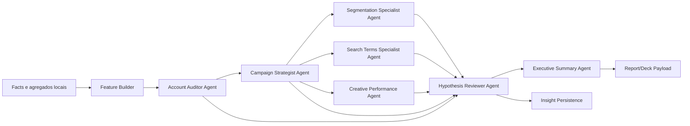
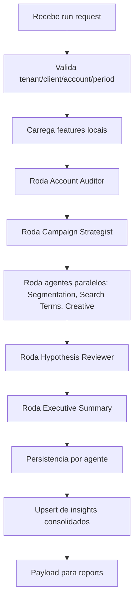

# Arquitetura de Time de Agentes Especialistas - Google Ads

Data de referencia: 2026-04-13

## 1. Objetivo

Evoluir a base atual para uma arquitetura interna de agentes especialistas em marketing de performance para Google Ads.

Esses agentes nao devem:

- consultar a Google Ads API em tempo real
- agir como um modelo generico unico
- inventar causas sem evidencia

Eles devem:

- ler apenas dados locais do banco e agregados
- produzir diagnosticos explicaveis
- separar sintoma, hipotese e acao
- calcular prioridade e confianca
- gerar linguagem tecnica e executiva

## 2. Decisao principal

A melhor arquitetura para a base atual e um modelo de `time de agentes coordenados por orchestrator`.

Cada agente tem:

- escopo analitico limitado
- entradas explicitamente estruturadas
- contrato de saida proprio
- responsabilidade clara

O orchestrator:

- decide a ordem de execucao
- prepara os payloads locais
- evita conflitos e duplicidade
- consolida a saida final em insights versionados

## 3. Encaixe na arquitetura atual

Base existente relevante:

- `apps/api/src/modules/analytics`
- `apps/api/src/modules/insights`
- `apps/api/src/modules/reports`
- `packages/shared/src/contracts`
- `database/schema-inicial.sql`

Recomendacao:

- manter `analytics` como camada de features e agregados
- evoluir `insights` para abrigar o `agent orchestration layer`
- manter `reports` para deck executivo final

### Modulo recomendado

Criar dentro de `insights` uma subarquitetura dedicada:

- `apps/api/src/modules/insights/application/agents`
- `apps/api/src/modules/insights/domain/agents`
- `apps/api/src/modules/insights/infrastructure/agents`

Motivo:

- a responsabilidade final desses agentes e gerar diagnostico e recomendacao
- isso pertence mais a `insights` do que a `analytics`

## 4. Visao geral da execucao



## 5. Ordem de execucao recomendada

### Ordem principal

1. `Account Auditor Agent`
2. `Campaign Strategist Agent`
3. `Segmentation Specialist Agent`
4. `Search Terms Specialist Agent`
5. `Creative Performance Agent`
6. `Hypothesis Reviewer Agent`
7. `Executive Summary Agent`

### Motivo da ordem

- primeiro entender a conta como um todo
- depois identificar quais campanhas merecem atencao
- depois aprofundar por segmentacao, termos e criativo
- depois revisar conflitos e causalidade
- por fim traduzir tudo para gestor e cliente

## 6. Responsabilidade de cada agente

## 6.1 Account Auditor Agent

### Responsabilidade

- avaliar a saude geral da conta
- identificar deterioracao ou melhora consolidada
- marcar prioridades macro
- detectar sinais de problema em budget pacing, CPA, ROAS, conversoes, CTR, share de impressao e recencia da sync

### Entradas

- `agg_client_kpi_daily`
- `agg_client_kpi_period`
- `fact_google_ads_account_daily`
- `client_kpi_targets`
- status da sincronizacao local
- periodo atual e baseline

### Saidas

- diagnostico macro da conta
- lista de sintomas consolidados
- campanhas candidatas para aprofundamento
- score de prioridade da conta
- score de confianca do diagnostico macro

### Quando deve falar

- sempre

### Quando deve ficar conservador

- baixa amostra
- sync atrasada
- baseline insuficiente

## 6.2 Campaign Strategist Agent

### Responsabilidade

- analisar campanhas individualmente
- classificar quais devem escalar, reduzir, revisar ou pausar
- separar vencedoras, neutras e drenadoras de verba

### Entradas

- saida do `Account Auditor Agent`
- `fact_google_ads_campaign_daily`
- `dim_campaigns`
- metas do cliente
- comparativos de periodo

### Saidas

- ranking de campanhas por prioridade
- recomendacao por campanha
- justificativa baseada em CPA, ROAS, conversoes, CTR, share de impressao e tendencia

### Dependencia

- depende do `Account Auditor Agent`

## 6.3 Segmentation Specialist Agent

### Responsabilidade

- analisar dispositivo, horario, dia da semana e regiao
- encontrar desperdicio por recorte
- encontrar janelas e recortes vencedores

### Entradas

- campanhas priorizadas pelo `Campaign Strategist Agent`
- `fact_google_ads_campaign_device_daily`
- `fact_google_ads_campaign_hourly`
- `fact_google_ads_campaign_geo_daily`

### Saidas

- insights de redistribuicao por recorte
- sugestoes de ajuste de programacao
- sugestoes de ajuste geografico
- sugestoes de redistribuicao entre dispositivos

### Dependencia

- depende do `Campaign Strategist Agent`

## 6.4 Search Terms Specialist Agent

### Responsabilidade

- analisar termos de pesquisa
- encontrar desperdicio sem conversao
- encontrar termos promissores
- sugerir negativas e refinamento de correspondencia

### Entradas

- campanhas priorizadas
- `fact_google_ads_search_term_daily` quando existir
- `dim_search_terms` quando existir
- metadados de volume e janela

### Saidas

- lista de termos desperdicando verba
- lista de termos candidatos a escalar
- recomendacoes de negativas
- confianca da recomendacao por volume

### Dependencia

- depende do `Campaign Strategist Agent`

### Observacao

- no MVP, esse agente pode ser opcional ou rodar apenas quando houver dados suficientes

## 6.5 Creative Performance Agent

### Responsabilidade

- avaliar se o problema parece mais ligado a anuncio, criativo ou aderencia da mensagem
- trabalhar com sinais indiretos, nunca afirmacao absoluta

### Entradas

- `fact_google_ads_campaign_daily`
- `dim_campaigns`
- futuramente `fact_google_ads_ad_daily` e `dim_ads`
- saidas do `Campaign Strategist Agent`
- saidas do `Segmentation Specialist Agent`

### Saidas

- suspeita de fadiga ou baixa aderencia criativa
- probabilidade de problema de mensagem
- sugestao de teste de anuncios
- lacunas de dado quando nao for possivel sustentar a analise

### Dependencia

- depende do `Campaign Strategist Agent`
- pode usar contexto do `Segmentation Specialist Agent`

## 6.6 Hypothesis Reviewer Agent

### Responsabilidade

- revisar conclusoes dos agentes anteriores
- remover conflito causal
- bloquear afirmacoes sem evidencia
- consolidar hipoteses principais e alternativas
- deduplicar recomendacoes equivalentes

### Entradas

- saidas do `Account Auditor Agent`
- saidas do `Campaign Strategist Agent`
- saidas do `Segmentation Specialist Agent`
- saidas do `Search Terms Specialist Agent`
- saidas do `Creative Performance Agent`

### Saidas

- hipoteses aprovadas
- hipoteses rejeitadas
- unificacao de diagnosticos
- score final de confianca revisado

### Dependencia

- depende de todos os agentes analiticos anteriores

## 6.7 Executive Summary Agent

### Responsabilidade

- transformar a consolidacao revisada em narrativa
- gerar linguagem tecnica para gestor
- gerar linguagem executiva para cliente
- preparar payload para insights e relatorios

### Entradas

- saida do `Hypothesis Reviewer Agent`
- metadados de periodo
- metadados de cliente
- metas e contexto executivo

### Saidas

- resumo tecnico
- resumo executivo
- bullets de proximo passo
- destaques positivos e negativos
- pacote pronto para `reports`

### Dependencia

- depende do `Hypothesis Reviewer Agent`

## 7. Dependencias entre agentes

## 7.1 Grafo de dependencia

- `Account Auditor Agent`: sem dependencia previa
- `Campaign Strategist Agent`: depende de `Account Auditor Agent`
- `Segmentation Specialist Agent`: depende de `Campaign Strategist Agent`
- `Search Terms Specialist Agent`: depende de `Campaign Strategist Agent`
- `Creative Performance Agent`: depende de `Campaign Strategist Agent`
- `Hypothesis Reviewer Agent`: depende de todos os anteriores
- `Executive Summary Agent`: depende de `Hypothesis Reviewer Agent`

## 7.2 Paralelizacao recomendada

Podem rodar em paralelo depois do `Campaign Strategist Agent`:

- `Segmentation Specialist Agent`
- `Search Terms Specialist Agent`
- `Creative Performance Agent`

Motivo:

- compartilham a mesma campanha priorizada como entrada
- analisam cortes diferentes

## 8. Contrato JSON de saida de cada agente

## 8.1 Envelope base comum

Todos os agentes devem usar um envelope comum.

```json
{
  "agent_name": "campaign_strategist",
  "agent_version": "1.0.0",
  "tenant_id": "1",
  "client_id": "5",
  "account_id": "5",
  "analysis_window": {
    "period_label": "last_7d",
    "period_start": "2026-04-01",
    "period_end": "2026-04-07",
    "baseline_start": "2026-03-25",
    "baseline_end": "2026-03-31"
  },
  "generated_at": "2026-04-13T12:00:00Z",
  "status": "ready",
  "priority_score": 82,
  "confidence_score": 0.86,
  "data_quality": {
    "is_sync_stale": false,
    "has_minimum_volume": true,
    "warnings": []
  }
}
```

## 8.2 Account Auditor Agent

```json
{
  "agent_name": "account_auditor",
  "scope": "account",
  "account_summary": {
    "spend": 13247.12,
    "conversions": 275.8,
    "cpa": 48.04,
    "roas": 7.75
  },
  "detected_symptoms": [
    {
      "symptom_code": "account_efficiency_drop",
      "title": "Eficiencia da conta piorou",
      "evidence": [
        {
          "metric": "cpa",
          "current_value": 48.04,
          "baseline_value": 41.30,
          "delta_pct": 16.3,
          "note": "CPA acima da janela anterior"
        }
      ],
      "impact_level": "high"
    }
  ],
  "priority_campaign_ids": ["420001", "420003"],
  "recommended_focus": "Controlar desperdicio e redistribuir verba"
}
```

## 8.3 Campaign Strategist Agent

```json
{
  "agent_name": "campaign_strategist",
  "scope": "campaign_set",
  "campaign_decisions": [
    {
      "campaign_id": "420003",
      "campaign_name": "Remarketing Decor",
      "decision": "reduce_or_pause",
      "priority_score": 96,
      "confidence_score": 0.95,
      "diagnosis": "Campanha acima do custo medio da conta",
      "primary_hypothesis": "A campanha continua captando trafego com baixo retorno relativo",
      "recommended_action": "Reduzir 10% a 20% da verba e revisar segmentacao e mensagem",
      "evidence": []
    },
    {
      "campaign_id": "420001",
      "campaign_name": "Pesquisa Decoracao",
      "decision": "scale",
      "priority_score": 73,
      "confidence_score": 0.95,
      "diagnosis": "Campanha vencedora com espaco para crescer",
      "primary_hypothesis": "Existe margem de ganho com boa eficiencia e share de impressao abaixo do teto",
      "recommended_action": "Escalar budget de forma controlada",
      "evidence": []
    }
  ]
}
```

## 8.4 Segmentation Specialist Agent

```json
{
  "agent_name": "segmentation_specialist",
  "scope": "device_geo_schedule",
  "findings": [
    {
      "dimension": "device",
      "dimension_value": "mobile",
      "campaign_id": "420003",
      "diagnosis": "Mobile consome verba com CVR abaixo da media",
      "priority_score": 78,
      "confidence_score": 0.81,
      "recommended_action": "Reduzir exposicao em mobile e revisar experiencia da landing page"
    },
    {
      "dimension": "hour",
      "dimension_value": "11-13",
      "campaign_id": "420001",
      "diagnosis": "Faixa horaria vencedora",
      "priority_score": 61,
      "confidence_score": 0.76,
      "recommended_action": "Concentrar parte maior da verba nessa faixa"
    }
  ]
}
```

## 8.5 Search Terms Specialist Agent

```json
{
  "agent_name": "search_terms_specialist",
  "scope": "search_terms",
  "waste_terms": [
    {
      "term": "decoracao sala barata",
      "campaign_id": "420003",
      "spend": 312.10,
      "clicks": 44,
      "conversions": 0,
      "priority_score": 84,
      "confidence_score": 0.88,
      "recommended_action": "Adicionar como negativa ou restringir correspondencia"
    }
  ],
  "growth_terms": [
    {
      "term": "poltrona design premium",
      "campaign_id": "420001",
      "conversions": 9,
      "roas": 10.8,
      "priority_score": 67,
      "confidence_score": 0.79,
      "recommended_action": "Isolar em grupo mais controlado ou reforcar cobertura"
    }
  ]
}
```

## 8.6 Creative Performance Agent

```json
{
  "agent_name": "creative_performance",
  "scope": "creative_signal",
  "creative_signals": [
    {
      "campaign_id": "420003",
      "signal_type": "message_misalignment",
      "probability": "medium",
      "confidence_score": 0.64,
      "diagnosis": "Queda de CTR e piora de CPA sugerem perda de aderencia de mensagem",
      "evidence": [],
      "data_gaps": [
        "Nao ha dado de anuncio individual suficiente no MVP"
      ],
      "recommended_action": "Testar novas variacoes de titulo e proposta de valor"
    }
  ]
}
```

## 8.7 Hypothesis Reviewer Agent

```json
{
  "agent_name": "hypothesis_reviewer",
  "scope": "cross_agent_review",
  "approved_hypotheses": [
    {
      "entity_type": "campaign",
      "entity_id": "420003",
      "primary_hypothesis": "Baixa eficiencia sustentada com forte indico de problema de segmentacao e possivel desalinhamento de mensagem",
      "alternative_hypotheses": [
        "Landing page com baixa aderencia em mobile"
      ],
      "confidence_score": 0.87,
      "supporting_agents": [
        "campaign_strategist",
        "segmentation_specialist",
        "creative_performance"
      ]
    }
  ],
  "rejected_hypotheses": [
    {
      "hypothesis": "Problema de landing page confirmado",
      "reason": "Nao ha evidencia direta suficiente"
    }
  ],
  "deduplicated_actions": [
    {
      "entity_id": "420003",
      "final_action": "Reduzir verba e revisar segmentacao e mensagem"
    }
  ]
}
```

## 8.8 Executive Summary Agent

```json
{
  "agent_name": "executive_summary",
  "scope": "client_summary",
  "technical_summary": {
    "headline": "A conta pede redistribuicao de verba com foco em campanhas vencedoras e corte de desperdicio",
    "bullets": [
      "A campanha Remarketing Decor perdeu eficiencia relativa",
      "Pesquisa Decoracao segue como principal candidata a escala",
      "A conta ainda preserva ROAS saudavel, mas com sinais de deterioracao localizada"
    ]
  },
  "executive_summary": {
    "headline": "Hoje o investimento tem uma oportunidade clara de ficar mais eficiente",
    "bullets": [
      "Existe uma frente que esta consumindo verba com retorno abaixo do esperado",
      "Tambem existe uma campanha com bom resultado e espaco para crescer",
      "O proximo passo e redistribuir investimento com mais criterio"
    ]
  },
  "next_steps": [
    "Reduzir verba em Remarketing Decor",
    "Escalar Pesquisa Decoracao de forma controlada",
    "Revisar segmentacao e mensagem da campanha com pior eficiencia"
  ]
}
```

## 9. Como o orchestrator deve funcionar

## 9.1 Responsabilidade do orchestrator

O orchestrator deve:

- carregar contexto do tenant, cliente, conta e periodo
- validar recencia e integridade da sync
- montar payloads locais por agente
- executar agentes na ordem correta
- persistir cada saida
- detectar duplicidade e conflito
- consolidar em `insights` e `reports`

## 9.2 Fluxo do orchestrator



## 9.3 Regras operacionais do orchestrator

- nao roda se a sync estiver `stale` acima do limite configurado
- marca `data_quality_warning` quando a sync estiver `warning`
- bloqueia agente especializado se faltar tabela ou volume minimo
- gera `run_uuid` unico por execucao
- usa `dedupe_key` por `tenant_id + client_id + account_id + analysis_window + orchestrator_version`

## 10. Como persistir a saida no banco

## 10.1 Tabelas recomendadas

Recomendado adicionar:

- `agent_runs`
- `agent_run_outputs`
- `agent_findings`
- `agent_conflicts`

## 10.2 Modelo minimo

### `agent_runs`

Responsabilidade:

- registrar a execucao do orchestrator e de cada agente

Campos principais:

- `id`
- `tenant_id`
- `client_id`
- `google_ads_account_id`
- `orchestrator_run_uuid`
- `agent_name`
- `agent_version`
- `analysis_window_label`
- `period_start`
- `period_end`
- `baseline_start`
- `baseline_end`
- `status`
- `priority_score`
- `confidence_score`
- `started_at`
- `finished_at`
- `error_code`
- `error_message`
- `data_quality_json`

### `agent_run_outputs`

Responsabilidade:

- armazenar o JSON bruto validado da saida de cada agente

Campos principais:

- `id`
- `tenant_id`
- `agent_run_id`
- `output_hash`
- `output_json`
- `created_at`

### `agent_findings`

Responsabilidade:

- armazenar findings normalizados para consulta operacional

Campos principais:

- `id`
- `tenant_id`
- `client_id`
- `google_ads_account_id`
- `agent_name`
- `finding_key`
- `entity_type`
- `entity_id`
- `category`
- `diagnosis`
- `primary_hypothesis`
- `recommended_action`
- `priority_score`
- `confidence_score`
- `risk_level`
- `status`
- `source_run_id`
- `created_at`

### `agent_conflicts`

Responsabilidade:

- registrar conflitos detectados pelo `Hypothesis Reviewer Agent`

Campos principais:

- `id`
- `tenant_id`
- `client_id`
- `entity_type`
- `entity_id`
- `conflict_type`
- `source_agents_json`
- `resolution`
- `created_at`

## 10.3 Relacao com tabelas existentes

- `insights`: continua sendo a camada final consultavel pelo produto
- `insight_versions`: guarda historico recalculado
- `executive_reports`: recebe o payload consolidado do `Executive Summary Agent`

Fluxo recomendado:

1. persistir saida bruta em `agent_run_outputs`
2. persistir findings normalizados em `agent_findings`
3. consolidar em `insights` e `insight_versions`
4. gerar payload executivo para `executive_reports`

## 11. Como evitar duplicidade e conflito entre agentes

## 11.1 Duplicidade

Cada finding precisa de uma chave unica:

`tenant_id + client_id + account_id + entity_type + entity_id + category + action_type + analysis_window`

Campos recomendados:

- `finding_key`
- `output_hash`
- `source_agent`

Regra:

- se dois agentes produzirem a mesma acao para a mesma entidade, o orchestrator mantem uma so
- `Hypothesis Reviewer Agent` decide o texto final e lista os agentes de suporte

## 11.2 Conflito

Exemplo de conflito:

- `Campaign Strategist Agent` quer escalar
- `Segmentation Specialist Agent` quer reduzir por mobile

Resolucao recomendada:

- o `Hypothesis Reviewer Agent` nao escolhe “escalar” ou “reduzir” de forma binaria
- ele pode consolidar em:
  - `escalar com restricao`
  - `redistribuir verba antes de escalar`
  - `investigar antes de ampliar`

## 11.3 Regras obrigatorias

- nunca somar confianca de forma ingenua
- nunca fundir duas recomendacoes se a causa provavel for diferente
- nunca promover acao agressiva sem volume minimo
- quando houver conflito sem evidencia suficiente, rebaixar prioridade e marcar `investigate`

## 12. Estrutura de pastas sugerida

```text
apps/api/src/modules/insights/
  application/
    agents/
      account-auditor.agent.ts
      campaign-strategist.agent.ts
      segmentation-specialist.agent.ts
      search-terms-specialist.agent.ts
      creative-performance.agent.ts
      hypothesis-reviewer.agent.ts
      executive-summary.agent.ts
      performance-agent-orchestrator.service.ts
      performance-agent-persistence.service.ts
      performance-agent-dedupe.service.ts
      performance-agent-conflict-resolver.service.ts
      performance-agent-payload-builder.service.ts
  domain/
    agents/
      performance-agent.types.ts
      performance-agent.constants.ts
      performance-agent.rules.ts
      performance-agent.schemas.ts
  infrastructure/
    agents/
      performance-agent.repository.ts
      performance-agent-feature-reader.repository.ts
  presentation/
    http/
      performance-agent.controller.ts
      dto/
        run-performance-agent.dto.ts
        list-agent-runs.dto.ts
```

## 13. Lista de arquivos a criar

## 13.1 Backend

- `apps/api/src/modules/insights/application/agents/account-auditor.agent.ts`
- `apps/api/src/modules/insights/application/agents/campaign-strategist.agent.ts`
- `apps/api/src/modules/insights/application/agents/segmentation-specialist.agent.ts`
- `apps/api/src/modules/insights/application/agents/search-terms-specialist.agent.ts`
- `apps/api/src/modules/insights/application/agents/creative-performance.agent.ts`
- `apps/api/src/modules/insights/application/agents/hypothesis-reviewer.agent.ts`
- `apps/api/src/modules/insights/application/agents/executive-summary.agent.ts`
- `apps/api/src/modules/insights/application/agents/performance-agent-orchestrator.service.ts`
- `apps/api/src/modules/insights/application/agents/performance-agent-persistence.service.ts`
- `apps/api/src/modules/insights/application/agents/performance-agent-dedupe.service.ts`
- `apps/api/src/modules/insights/application/agents/performance-agent-conflict-resolver.service.ts`
- `apps/api/src/modules/insights/application/agents/performance-agent-payload-builder.service.ts`
- `apps/api/src/modules/insights/domain/agents/performance-agent.types.ts`
- `apps/api/src/modules/insights/domain/agents/performance-agent.schemas.ts`
- `apps/api/src/modules/insights/infrastructure/agents/performance-agent.repository.ts`
- `apps/api/src/modules/insights/infrastructure/agents/performance-agent-feature-reader.repository.ts`
- `apps/api/src/modules/insights/presentation/http/performance-agent.controller.ts`
- `apps/api/src/modules/insights/presentation/http/dto/run-performance-agent.dto.ts`

## 13.2 Shared contracts

- `packages/shared/src/contracts/performance-agent-run.ts`
- `packages/shared/src/contracts/performance-agent-finding.ts`
- `packages/shared/src/contracts/performance-agent-summary.ts`

## 13.3 Banco

- migration ou update do schema para:
  - `agent_runs`
  - `agent_run_outputs`
  - `agent_findings`
  - `agent_conflicts`

## 14. Contratos compartilhados recomendados

### `performance-agent-run.ts`

- envelope comum da execucao

### `performance-agent-finding.ts`

- contrato normalizado de finding

### `performance-agent-summary.ts`

- contrato final consolidado para UI e reports

## 15. Como expor isso na API

Endpoints recomendados:

- `POST /api/insights/agents/run`
- `GET /api/insights/agents/runs`
- `GET /api/insights/agents/runs/:id`
- `GET /api/insights/agents/findings`

Regra:

- endpoints protegidos por tenant e papel
- nunca expor payloads de outro tenant
- limitar reexecucao manual por permissao e rate limit

## 16. Como a UI deve consumir

A UI nao consome cada agente isoladamente como fonte principal.

A UI deve consumir:

- `findings consolidados`
- `insights aprovados`
- `summary tecnico`
- `summary executivo`

Uso recomendado:

- dashboard do gestor: findings tecnicos consolidados
- modulo de insights: detalhe com agentes de suporte
- deck/report: saida do `Executive Summary Agent`

## 17. Plano de implementacao em etapas

## Etapa 1. Fundacao de contratos e persistencia

- criar contratos compartilhados
- criar tabelas `agent_runs`, `agent_run_outputs`, `agent_findings`, `agent_conflicts`
- criar repositores e persistence service

## Etapa 2. Orchestrator minimo

- criar `performance-agent-orchestrator.service.ts`
- implementar `run_uuid`, dedupe e controle de execucao
- integrar com `insights.module.ts`

## Etapa 3. Agentes MVP

Implementar primeiro:

- `Account Auditor Agent`
- `Campaign Strategist Agent`
- `Hypothesis Reviewer Agent`
- `Executive Summary Agent`

Motivo:

- isso ja produz valor macro e narrativa

## Etapa 4. Especialistas de aprofundamento

Adicionar:

- `Segmentation Specialist Agent`
- `Creative Performance Agent`

Motivo:

- aumenta qualidade do diagnostico sem depender ainda de search terms completo

## Etapa 5. Search Terms Specialist

Adicionar quando a camada de termos estiver madura:

- `Search Terms Specialist Agent`

## Etapa 6. Integracao total com insights e reports

- consolidar em `insights` e `insight_versions`
- alimentar `Executive Summary Agent`
- alimentar `reports`

## Etapa 7. UX e governanca operacional

- tela de execucoes por agente
- tela de conflitos e revisoes
- filtros por tenant, cliente, periodo e entidade
- auditoria de cada rodada do orchestrator

## 18. Recomendacao final

Para a base atual, a melhor estrategia e:

- `nao` criar um agente generico unico
- `sim` criar um orchestrator com agentes especialistas pequenos
- `sim` fazer cada agente trabalhar apenas com evidencias locais e payload enxuto
- `sim` usar o `Hypothesis Reviewer Agent` como guardiao de causalidade e consistencia
- `sim` usar o `Executive Summary Agent` como ponte entre diagnostico tecnico e narrativa executiva

Essa arquitetura preserva:

- confiabilidade
- explicabilidade
- seguranca
- escalabilidade do raciocinio
- encaixe natural na estrutura atual do projeto
