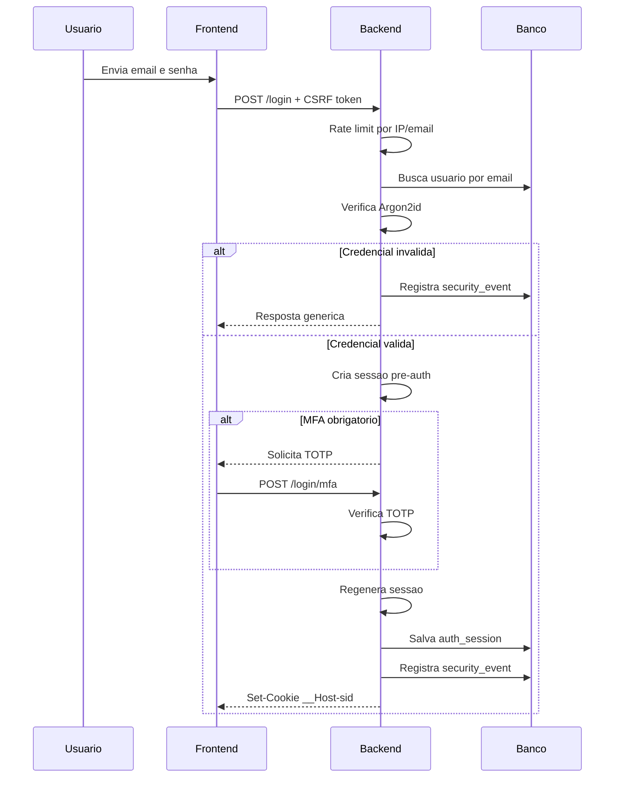
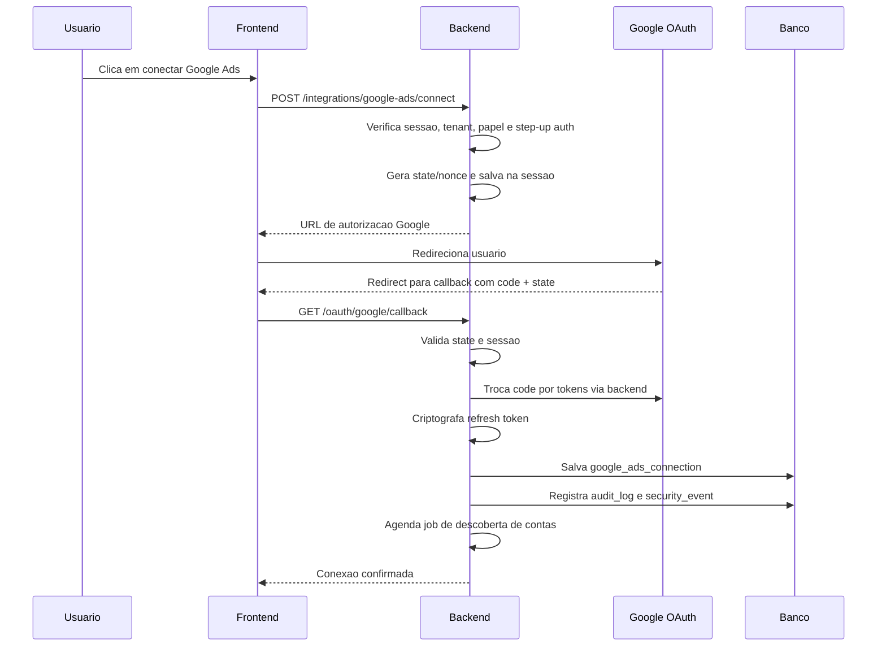
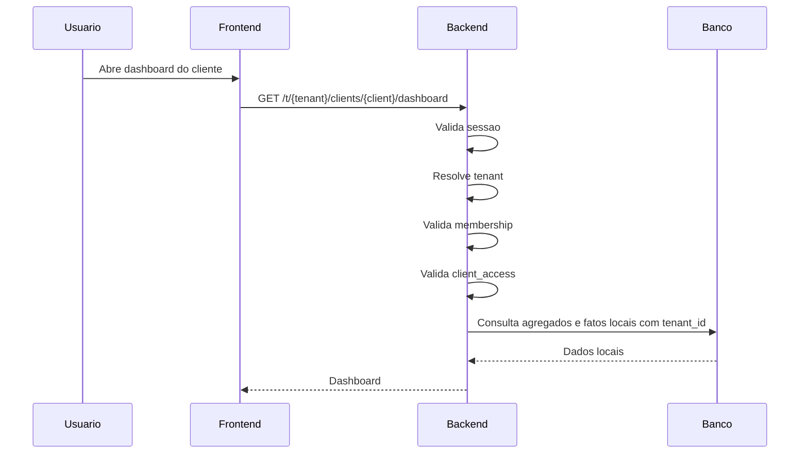

# Autenticacao, Autorizacao e Seguranca - SaaS Multi-tenant Google Ads

Data de referencia: 2026-04-06

## 1. Decisao principal

### Modelo recomendado

- **Autenticacao da plataforma separada do OAuth do Google Ads**
- **Sessao server-side**
- **RBAC + escopo por tenant + escopo por cliente**
- **Criptografia de tokens sensiveis em repouso**
- **Auditoria funcional + eventos de seguranca**

### Motivo

- evita acoplamento entre login do SaaS e conta Google do cliente
- facilita revogacao de sessao e troca de tenant
- reduz risco de vazamento entre tenants
- fica mais simples de operar em Hostinger/VPS do que um desenho com JWT distribuido

## 2. Modelo de autenticacao

### 2.1 Autenticacao primaria da plataforma

Usar:

- `email + senha`
- `MFA TOTP` obrigatorio para `superadmin` e `agency_admin`
- `MFA TOTP` recomendado para `manager` e `analyst`
- `client_viewer` pode entrar sem MFA no MVP, mas com MFA altamente recomendado

### 2.2 O que NAO usar como padrao

- nao usar o login Google como autenticacao principal do SaaS no MVP
- nao usar refresh token do Google Ads como identidade de usuario
- nao usar JWT stateless como sessao primaria de navegador

### 2.3 Hash de senha

- usar `Argon2id`
- parametros de custo devem ser calibrados no servidor de producao
- nunca armazenar senha reversivel

### 2.4 Recuperacao de conta

- fluxo de reset com token aleatorio de uso unico
- token armazenado como `hash`, nunca em texto puro
- expirar em 15 a 30 minutos
- invalidar sessoes existentes apos reset de senha

### 2.5 Superadmin

`superadmin` deve ser um papel **de plataforma**, nao um papel de tenant.

Regra recomendada:

- `superadmin` nao le dados de tenant por padrao
- para entrar em tenant, deve ativar **support mode**
- support mode exige:
  - MFA recente
  - justificativa
  - expiracao curta
  - auditoria reforcada

Motivo:

- diminui risco de acesso irrestrito invisivel
- fortalece a promessa de isolamento entre agencias

## 3. Modelo de autorizacao baseado em papeis e escopos

### 3.1 Camadas de autorizacao

A autorizacao deve ser avaliada em 4 camadas:

1. `platform_role`
2. `tenant_membership.role`
3. `client_access.access_level`
4. permissao da acao

### 3.2 Papeis

#### `superadmin`

- uso interno da plataforma
- gerencia operacao global
- nao acessa tenant automaticamente

#### `agency_admin`

- administra usuarios, clientes, integracoes e relatorios do tenant
- ve todos os clientes do tenant

#### `manager`

- opera clientes atribuidos
- pode gerar relatorios e acionar sync manual sob limite

#### `analyst`

- leitura e operacao limitada em clientes atribuidos
- nao altera configuracoes criticas

#### `client_viewer`

- ve apenas o proprio cliente
- baixa relatorios autorizados
- nao acessa logs tecnicos nem configuracoes

### 3.3 Regra de avaliacao

O backend deve avaliar na seguinte ordem:

1. usuario autenticado
2. sessao valida
3. tenant resolvido e validado
4. membership ativo no tenant
5. client scope valido, quando existir
6. permissao especifica da acao

### 3.4 Matriz minima de permissoes

Permissoes chave:

- `tenant.manage_users`
- `tenant.manage_roles`
- `client.read`
- `client.update`
- `integration.connect_google_ads`
- `integration.disconnect_google_ads`
- `sync.run_manual`
- `report.generate`
- `report.export`
- `audit.view`
- `security.view`

### 3.5 Regra estrutural

- **deny by default**
- toda rota protegida precisa declarar permissao explicita
- todo acesso a recurso precisa validar `tenant_id`
- recurso de cliente tambem precisa validar `client_access`

## 4. Estrategia de sessoes

### 4.1 Escolha

Usar **sessao server-side em banco** no MVP.

Motivo:

- revogacao simples
- troca de tenant simples
- auditoria simples
- menos risco de erro de implementacao do que JWT de longa duracao

### 4.2 Cookie

Usar cookie:

- `HttpOnly`
- `Secure`
- `SameSite=Lax`
- prefixo `__Host-`

Sugestao:

- `__Host-sid` para sessao autenticada
- `__Host-xsrf` para token CSRF legivel pelo frontend quando necessario

### 4.3 Politica de tempo

Recomendacao pratica:

- sessao autenticada: `idle timeout` de 8 horas
- expiracao absoluta: 24 horas
- step-up auth para acoes sensiveis: 15 minutos

Acoes sensiveis:

- conectar Google Ads
- desconectar Google Ads
- alterar papeis
- exportar dados sensiveis
- entrar em support mode

### 4.4 Rotacao de sessao

Regenerar o identificador de sessao:

- apos login bem-sucedido
- apos MFA bem-sucedido
- apos troca de tenant
- apos troca de papel/escopo
- apos reset de senha

### 4.5 Revogacao

Revogar sessoes:

- em logout
- em reset de senha
- em troca de senha
- em suspeita de comprometimento
- quando `mfa_secret` for trocado

### 4.6 Tabela recomendada

Usar `auth_sessions`:

- `user_id`
- `active_tenant_id`
- `active_membership_id`
- `session_token_hash`
- `csrf_token_hash`
- `mfa_verified_at`
- `ip_hash`
- `user_agent_hash`
- `last_seen_at`
- `expires_at`
- `revoked_at`

## 5. Estrategia para armazenar refresh tokens e secrets

### 5.1 Segredos da aplicacao

Armazenar apenas em variaveis de ambiente:

- `GOOGLE_CLIENT_ID`
- `GOOGLE_CLIENT_SECRET`
- `GOOGLE_ADS_DEVELOPER_TOKEN`
- `APP_KEK_CURRENT`
- `APP_KEK_PREVIOUS`
- `SESSION_SECRET`

Nunca:

- salvar em frontend
- salvar em Git
- imprimir em log

### 5.2 Tokens Google Ads

Armazenar apenas:

- `refresh_token` criptografado
- metadados do owner da conexao
- `login_customer_id`
- `manager_customer_id`
- status da conexao

Nao armazenar persistentemente:

- `access_token`, salvo cache curto se realmente necessario

### 5.3 Estrategia por fase

#### MVP

- criptografar o `refresh_token` com `AES-256-GCM`
- chave mestre carregada de variavel de ambiente
- salvar no banco:
  - `ciphertext`
  - `iv`
  - `tag`
  - `key_version`

#### Recomendado

- usar envelope encryption
- gerar uma `DEK` por registro ou por conexao
- proteger a `DEK` com uma `KEK` do app

### 5.4 Rotacao de chave

Guardar `key_version` junto do segredo.

Fluxo:

1. aplicar nova `KEK`
2. novas gravacoes usam a nova versao
3. registros antigos sao recriptografados gradualmente

## 6. Criptografia em repouso

### O que deve ser hash

- `password_hash` com `Argon2id`
- `session_token_hash`
- `csrf_token_hash`
- `password_reset_tokens.token_hash`

### O que deve ser criptografado

- `google_ads_connections.refresh_token_*`
- `users.mfa_secret_*`
- codigos de recuperacao MFA se forem persistidos
- qualquer segredo operacional sensivel

### O que e bonus, mas nao substitui a aplicacao

- criptografia de disco do provedor
- criptografia nativa do banco

Motivo:

- se a aplicacao vaza o dado em claro, a criptografia de disco nao resolve

## 7. Regras de auditoria

### 7.1 Separacao recomendada

Usar 2 trilhas:

- `audit_logs` para eventos funcionais
- `security_events` para eventos de seguranca

### 7.2 O que registrar em `security_events`

- login bem-sucedido
- login falho
- MFA falho
- MFA habilitado/desabilitado
- reset de senha solicitado
- reset de senha concluido
- bloqueio por brute force
- tentativa de troca de tenant sem permissao
- tentativa de acesso cross-tenant
- entrada em support mode
- conexao/desconexao Google Ads

### 7.3 O que registrar em `audit_logs`

- criacao/edicao de cliente
- alteracao de metas
- alteracao de papeis
- geracao de relatorio
- exportacao de dados
- download de apresentacao
- sync manual
- aprovacao ou descarte de insight

### 7.4 Campos minimos

- `who`: `user_id`, `actor_membership_id`, `auth_session_id`
- `where`: `tenant_id`, `client_id`, `request_id`, `correlation_id`
- `what`: `event_name`, `event_category`, `resource_type`, `resource_id`
- `result`: sucesso, falha, bloqueado
- `when`: timestamp UTC
- `network`: `ip_hash`, `user_agent_hash`

### 7.5 Retencao

- `security_events`: 12 meses ou mais
- `audit_logs`: 12 a 24 meses

## 8. Protecoes por ameaca

### 8.1 SQL injection

Controles:

- ORM/query builder com parametros
- proibido concatenar SQL com input do usuario
- allowlist para `sort`, `filter`, `group by`
- revisar manualmente qualquer query raw

### 8.2 XSS

Controles:

- React com escape padrao
- proibido `dangerouslySetInnerHTML` sem sanitizacao
- sanitizar HTML rico com biblioteca dedicada
- `Content-Security-Policy`
- `frame-ancestors 'none'` ou allowlist estrita

### 8.3 CSRF

Como a autenticacao e por cookie, usar:

- token CSRF sincronizado
- validacao de `Origin` e `Referer`
- `Sec-Fetch-Site` e demais `Fetch Metadata`
- `SameSite=Lax`
- nenhuma mutacao em `GET`

### 8.4 IDOR

Controles:

- toda leitura usa `tenant_id + id`
- recursos de cliente usam `tenant_id + client_id + id`
- repositorios devem aplicar tenant scope estruturalmente
- usar UUID publico ou ID opaco como defesa adicional

### 8.5 Brute force

Controles:

- rate limit por IP + email + tenant
- backoff progressivo
- bloqueio temporario apos repetidas falhas
- MFA para papeis privilegiados
- alerta de seguranca para padrao suspeito

### 8.6 Enumeracao de contas

Controles:

- mensagem de erro generica no login
- mesma resposta em reset de senha independentemente da existencia do email
- tempos de resposta sem diferenca gritante
- nao expor se o email pertence a tenant X

### 8.7 Vazamento entre tenants

Controles estruturais:

- tenant context resolvido no inicio da requisicao
- nunca confiar em `tenant_id` vindo de body/header sem validacao
- todo cache key inclui `tenant_id`
- todo path de storage inclui prefixo do tenant
- toda query de negocio inclui filtro por tenant
- testes automatizados de cross-tenant

### 8.8 Vazamento entre clientes dentro do mesmo tenant

Controles:

- validar `client_access` em toda leitura ou mutacao de cliente
- `manager` e `analyst` nao leem cliente fora do escopo
- exportacoes tambem validam escopo

## 9. Middleware de validacao de tenant

### 9.1 Resolucao recomendada

Para simplicidade operacional no MVP, prefira **tenant no path**:

- `/t/{tenantSlug}/...`

Motivo:

- evita complexidade com wildcard DNS e subdominio na Hostinger
- facilita logs, testes e roteamento

### 9.2 Ordem dos middlewares

1. `requestIdMiddleware`
2. `securityHeadersMiddleware`
3. `sessionMiddleware`
4. `authenticationMiddleware`
5. `tenantResolutionMiddleware`
6. `tenantMembershipMiddleware`
7. `clientScopeMiddleware`
8. `permissionMiddleware`

### 9.3 Regras do `tenantResolutionMiddleware`

- ler `tenantSlug` da rota
- buscar tenant ativo
- validar que a sessao tem membership ativo nesse tenant
- comparar com `active_tenant_id`
- se houver troca de tenant legitima, rotacionar sessao
- anexar `tenantContext` ao request

### 9.4 Regras do `clientScopeMiddleware`

- se a rota tem `client_id`, validar:
  - `client.tenant_id == request.tenantContext.tenant_id`
  - membership do usuario tem acesso ao cliente

### 9.5 Regras de suporte

- `superadmin` so entra por middleware especial de support mode
- support mode deve exigir justificativa e gerar evento de seguranca

## 10. Estrategia de logs sem vazar segredos

### 10.1 Formato

Logs estruturados em JSON com:

- `timestamp`
- `level`
- `request_id`
- `user_id`
- `tenant_id`
- `client_id`
- `route`
- `action`
- `status_code`
- `duration_ms`

### 10.2 Campos proibidos

Nunca logar em claro:

- `Authorization`
- `Cookie`
- `Set-Cookie`
- `password`
- `access_token`
- `refresh_token`
- `client_secret`
- `developer_token`
- `session_id`
- `csrf_token`
- string de conexao do banco

### 10.3 Politica de mascaramento

- e-mail: mascarar parcialmente quando nao for essencial
- IP: armazenar `hash`
- user agent: armazenar `hash`
- IDs sensiveis externos: truncar ou hash quando necessario

### 10.4 Regra operacional

- falha de log nao derruba requisicao de negocio
- logs possuem acesso restrito
- logs antigos sao rotacionados e protegidos

## 11. Checklist de seguranca para producao

- HTTPS forcado em todas as rotas
- HSTS habilitado
- cookies `Secure`, `HttpOnly`, `SameSite`
- CSP habilitada
- CSRF token habilitado
- `Origin/Referer` validados
- `Fetch Metadata` habilitado
- senha com `Argon2id`
- MFA obrigatorio para papeis privilegiados
- rate limit por login, reset, export e sync manual
- sessao rotacionada apos login/MFA/troca de tenant
- refresh tokens criptografados em repouso
- segredos somente em variaveis de ambiente
- redirect URIs do Google estritamente cadastradas
- escopo minimo do Google Ads
- queries sempre com `tenant_id`
- cache keys com prefixo de tenant
- storage paths com prefixo de tenant
- auditoria habilitada
- security events habilitados
- backups do banco criptografados
- restore testado periodicamente
- usuario do banco com privilegio minimo
- dependencias com scanner de vulnerabilidade
- logs com redacao de segredos
- testes automatizados de isolamento cross-tenant

## 12. Fluxo seguro de login

### Regras do fluxo

- resposta de erro nao informa se o e-mail existe
- MFA vem antes de emitir sessao final
- sessao final so nasce apos autenticacao completa
- se houver tenant padrao, ele e definido na sessao; senao usuario escolhe tenant apos login

## 13. Fluxo seguro de conexao com Google Ads

### Regras do fluxo

- `client_secret` nunca vai para o frontend
- callback aceita apenas `redirect_uri` previamente cadastrado
- usar `state` obrigatoriamente
- pedir `access_type=offline`
- armazenar apenas refresh token criptografado
- se desconectar, revogar localmente e apagar/invalidar refresh token

## 14. Fluxo seguro de leitura de dados no dashboard

### Regras do fluxo

- dashboard nao chama Google Ads API na abertura
- leitura usa somente dados locais
- queries sempre incluem `tenant_id`
- `manager` e `analyst` so veem clientes atribuidos
- exportacao e download geram auditoria

## 15. Observacao importante sobre "isolamento absoluto"

### Verdade operacional

Em **banco compartilhado**, o isolamento absoluto depende de:

- middleware correto
- repositorio correto
- cache/storage corretos
- testes corretos

Isso pode ser **muito seguro**, mas nao e o mesmo que isolamento fisico.

### Quando subir o nivel

Se um cliente exigir isolamento mais forte:

- banco por tenant
- storage por tenant
- chaves segregadas por tenant

## 16. Fontes atuais usadas

- Google OAuth web server flow: [Using OAuth 2.0 for Web Server Applications](https://developers.google.com/identity/protocols/oauth2/web-server)
- Google Ads auth model: [Use OAuth 2.0 to Access Google Ads API](https://developers.google.com/google-ads/api/docs/oauth/overview)
- Google Ads 2-step verification behavior: [2-Step Verification](https://developers.google.com/google-ads/api/docs/oauth/2sv)
- OWASP Authentication: [Authentication Cheat Sheet](https://cheatsheetseries.owasp.org/cheatsheets/Authentication_Cheat_Sheet.html)
- OWASP Password Storage: [Password Storage Cheat Sheet](https://cheatsheetseries.owasp.org/cheatsheets/Password_Storage_Cheat_Sheet.html)
- OWASP Session Management: [Session Management Cheat Sheet](https://cheatsheetseries.owasp.org/cheatsheets/Session_Management_Cheat_Sheet.html)
- OWASP Authorization: [Authorization Cheat Sheet](https://cheatsheetseries.owasp.org/cheatsheets/Authorization_Cheat_Sheet.html)
- OWASP Multi-tenant Security: [Multi-Tenant Application Security Cheat Sheet](https://cheatsheetseries.owasp.org/cheatsheets/Multi_Tenant_Security_Cheat_Sheet.html)
- OWASP IDOR: [Insecure Direct Object Reference Prevention Cheat Sheet](https://cheatsheetseries.owasp.org/cheatsheets/Insecure_Direct_Object_Reference_Prevention_Cheat_Sheet.html)
- OWASP CSRF: [Cross-Site Request Forgery Prevention Cheat Sheet](https://cheatsheetseries.owasp.org/cheatsheets/Cross-Site_Request_Forgery_Prevention_Cheat_Sheet.html)
- OWASP SQL Injection: [SQL Injection Prevention Cheat Sheet](https://cheatsheetseries.owasp.org/cheatsheets/SQL_Injection_Prevention_Cheat_Sheet.html)
- OWASP CSP: [Content Security Policy Cheat Sheet](https://cheatsheetseries.owasp.org/cheatsheets/Content_Security_Policy_Cheat_Sheet.html)
- OWASP Logging: [Logging Cheat Sheet](https://cheatsheetseries.owasp.org/cheatsheets/Logging_Cheat_Sheet.html)
- OWASP MFA: [Multifactor Authentication Cheat Sheet](https://cheatsheetseries.owasp.org/cheatsheets/Multifactor_Authentication_Cheat_Sheet.html)
