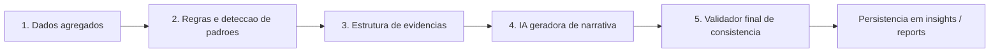

# Camada de IA Explicativa - Google Ads

Data de referencia: 2026-04-06

## 1. Decisao principal

A IA nao deve analisar dados crus.

Ela deve entrar somente depois que o sistema:

1. agregou os dados
2. aplicou regras
3. detectou padroes
4. estruturou as evidencias

### Motivo

- reduz alucinacao
- reduz custo de contexto
- aumenta consistencia entre insights
- permite validar a saida antes de salvar ou mostrar ao usuario

## 2. Arquitetura em camadas



### 2.1 Dados agregados [MVP]

Entradas permitidas:

- `agg_client_kpi_daily`
- `agg_client_kpi_period`
- `fact_google_ads_account_daily`
- `fact_google_ads_campaign_daily`
- `fact_google_ads_campaign_device_daily`
- `fact_google_ads_campaign_hourly`
- `fact_google_ads_campaign_geo_daily`
- `client_kpi_targets`
- metadados de recencia e integridade da sync

Saida:

- metricas ja calculadas
- deltas entre periodos
- baseline por conta/campanha
- metas aplicadas

### 2.2 Regras e deteccao de padroes [MVP]

Responsabilidade:

- identificar sintomas
- classificar hipoteses provaveis
- escolher acoes candidatas
- calcular prioridade e confianca

Saida:

- `ruleCode`
- `ruleFamily`
- `diagnosisCode`
- `allowedHypotheses`
- `recommendedActionCandidates`

### 2.3 Estrutura de evidencias [MVP]

Responsabilidade:

- transformar a deteccao em um pacote pequeno, explicito e verificavel

Saida:

- `evidenceId`
- metrica
- valor atual
- baseline
- delta
- janela
- interpretacao curta
- limitacoes do dado

### 2.4 IA geradora de narrativa [MVP]

Responsabilidade:

- converter evidencias em texto legivel
- gerar uma versao tecnica e outra executiva
- manter disciplina causal

Regra:

- a IA nao calcula metrica
- a IA nao escolhe entidade fora do payload
- a IA nao cria nova hipotese fora da allowlist

### 2.5 Validador final de consistencia [MVP]

Responsabilidade:

- validar schema JSON
- garantir que a resposta referencia apenas evidencias enviadas
- bloquear linguagem causal absoluta sem suporte
- bloquear campos vazios ou fora do padrao
- fazer fallback para template deterministicamente se a IA falhar

## 3. Payload ideal para a IA

## 3.1 Estrutura recomendada [MVP]

Enviar apenas um `insight candidate` por chamada.

### Campos recomendados

- `payloadVersion`
- `locale`
- `timezone`
- `clientLabel`
- `audienceMode`
- `entity`
- `periodContext`
- `dataFreshness`
- `ruleContext`
- `summaryMetrics`
- `evidenceItems`
- `allowedHypotheses`
- `allowedActions`
- `dataGaps`
- `forbiddenClaims`
- `styleConstraints`

### Exemplo de payload

```json
{
  "payloadVersion": "1.0",
  "locale": "pt-BR",
  "timezone": "America/Sao_Paulo",
  "clientLabel": "Cliente Exemplo",
  "audienceMode": "dual",
  "entity": {
    "scopeType": "device",
    "scopeRef": "campaign:123/mobile",
    "scopeLabel": "Campanha Institucional > Mobile"
  },
  "periodContext": {
    "analysisWindow": "last_14d_vs_previous_14d",
    "periodStart": "2026-03-23",
    "periodEnd": "2026-04-05",
    "baselineStart": "2026-03-09",
    "baselineEnd": "2026-03-22"
  },
  "dataFreshness": {
    "dataAsOf": "2026-04-06T09:45:00Z",
    "syncStatus": "ok",
    "isIntradayPartial": false,
    "selectedPeriodCompleteUntil": "2026-04-05"
  },
  "ruleContext": {
    "ruleCode": "DEVICE_MOBILE_WASTE",
    "ruleFamily": "device_efficiency",
    "diagnosisCode": "CPA_UP_MIX_SHIFT",
    "priority": "high",
    "confidence": 0.84,
    "recommendedActionCandidates": [
      "shift_device",
      "decrease_budget",
      "review_landing_page"
    ]
  },
  "summaryMetrics": {
    "spend": 1240.50,
    "conversions": 14,
    "conversions_value": 4950.00,
    "cpa": 88.61,
    "roas": 3.99
  },
  "evidenceItems": [
    {
      "evidenceId": "ev_1",
      "metric": "cpa",
      "currentValue": 82.30,
      "baselineValue": 54.70,
      "deltaPct": 50.5,
      "window": "last_14d_vs_previous_14d",
      "interpretationHint": "CPA subiu fortemente no mobile."
    },
    {
      "evidenceId": "ev_2",
      "metric": "conversion_rate",
      "currentValue": 0.021,
      "baselineValue": 0.028,
      "deltaPct": -25.0,
      "window": "last_14d_vs_previous_14d",
      "interpretationHint": "A piora veio de queda de conversao por clique."
    },
    {
      "evidenceId": "ev_3",
      "metric": "spend_share",
      "currentValue": 0.41,
      "baselineValue": 0.30,
      "deltaPct": 36.7,
      "window": "last_14d_vs_previous_14d",
      "interpretationHint": "Mobile recebeu mais participacao de gasto."
    }
  ],
  "allowedHypotheses": [
    "mix_de_dispositivo_ineficiente",
    "experiencia_mobile_pode_estar_fraca",
    "trafego_mobile_menos_qualificado"
  ],
  "allowedActions": [
    "shift_device",
    "decrease_budget",
    "review_landing_page"
  ],
  "dataGaps": [
    "Nao ha dado de landing page fora da plataforma.",
    "Nao ha search terms neste insight."
  ],
  "forbiddenClaims": [
    "A landing page esta ruim como fato confirmado.",
    "O concorrente aumentou lances como fato confirmado."
  ],
  "styleConstraints": {
    "technicalMaxSentences": 4,
    "executiveMaxSentences": 3,
    "mustMentionDataGapWhenRelevant": true
  }
}
```

## 4. O que jamais deve ser enviado

### Segredos e credenciais

- `refresh_token`
- `access_token`
- `client_secret`
- `developer_token`
- `Authorization` header
- cookies
- chaves internas de criptografia

### Dados desnecessarios ou sensiveis

- logs tecnicos completos
- audit logs completos
- stack traces
- IP real do usuario
- user-agent em claro
- emails completos quando nao forem necessarios
- dados de outro tenant

### Dados que pioram o contexto

- linhas cruas demais de facts
- SQL bruto
- dumps completos de tabelas
- listas enormes de campanhas ou termos
- valores repetidos que nao alteram a narrativa

## 5. Como limitar o tamanho do contexto

### Regra principal [MVP]

Uma chamada de IA = um insight candidato.

### Limites praticos

- no maximo `1` entidade principal por chamada
- no maximo `5 a 8` `evidenceItems`
- no maximo `3` hipoteses permitidas
- no maximo `3` acoes permitidas
- no maximo `3` lacunas de dado
- no maximo `2` janelas comparativas por payload

### Estrategias de compressao

- arredondar numericos antes de enviar
- enviar apenas metricas que mudaram materialmente
- usar labels curtos para entidade
- agrupar horas consecutivas ou regioes equivalentes antes da IA
- remover qualquer campo que nao mude a explicacao final

### Regra de lote

Se houver muitos insights:

- o motor analitico ordena por prioridade
- a IA recebe primeiro os `top N`
- relatorio executivo pode depois agrupar os insights narrados

## 6. Como padronizar a saida

### Regras [MVP]

- resposta somente em JSON valido
- sem markdown
- sem texto fora do schema
- com `evidenceRefs` para apontar quais evidencias sustentam a narrativa
- com duas saidas separadas:
  - `technicalOutput`
  - `executiveOutput`

### Campos obrigatorios

- `title`
- `diagnosis`
- `primaryHypothesis`
- `recommendedAction`
- `expectedImpact`
- `priority`
- `confidence`
- `correlationType`
- `evidenceRefs`
- `dataLimitations`
- `technicalOutput`
- `executiveOutput`

## 7. Como evitar alucinacao

### Controles no payload

- enviar apenas evidencias estruturadas
- enviar `allowedHypotheses`
- enviar `allowedActions`
- enviar `forbiddenClaims`
- enviar `dataGaps`

### Controles no prompt

- proibir criacao de causa nao suportada
- obrigar mencao de lacuna quando ela for relevante
- obrigar uso de `correlationType`

### Controles no validador final

- validar JSON schema
- validar que `evidenceRefs` existem no payload
- bloquear frases causais absolutas quando `correlationType != confirmed`
- bloquear recomendacao fora de `allowedActions`
- fallback para template deterministico se a resposta falhar

### Tipos de `correlationType`

- `confirmed`
- `probable`
- `correlated_only`
- `insufficient_data`

No contexto Google Ads, o mais comum no MVP e:

- `probable`
- `correlated_only`

## 8. Como pedir postura de gestor de trafego

### Postura desejada

- agir como gestor de trafego pago senior
- focar em diagnostico operacional
- separar sintoma, hipotese e acao
- priorizar clareza sobre floreio
- assumir postura conservadora com causalidade

### O que a IA deve fazer

- escrever como quem revisa conta com foco em performance
- falar de verba, eficiencia, sinais e proximo passo
- admitir incerteza quando o dado nao prova a causa

### O que a IA nao deve fazer

- soar como consultor generico
- prometer resultado garantido
- usar jargao demais na versao executiva
- reprocessar metricas como se fosse o motor analitico

## 9. Como gerar as duas saidas

### 9.1 Saida tecnica para gestor

Objetivo:

- explicar metricas, comparativos, sinais e proximo passo operacional

Regras:

- incluir numeros relevantes
- mencionar janela comparativa
- mencionar limitacao quando houver
- usar linguagem de gestor, nao de cientista de dados

### 9.2 Saida simplificada para cliente

Objetivo:

- explicar problema, motivo provavel e acao em linguagem simples

Regras:

- no maximo 3 frases
- evitar siglas excessivas
- falar em retorno, desperdicio, investimento e proxima acao
- nao expor detalhe tecnico desnecessario

## 10. Prompt system

O prompt abaixo tambem foi salvo em [explainer-system.prompt.md](C:/Users/digom/OneDrive/Documentos/GoogleADS/apps/api/src/modules/insights/domain/prompts/explainer-system.prompt.md).

```text
Voce e uma camada de IA explicativa para um sistema de analise de Google Ads.

Seu papel NAO e analisar dados crus nem recalcular metricas. Seu papel e transformar um pacote estruturado de evidencias, ja processado por regras deterministicas, em narrativa clara e recomendacao legivel.

Assuma postura de gestor de trafego pago senior: objetivo, analitico, conservador com causalidade e pratico nas recomendacoes.

Regras obrigatorias:
1. Use apenas as evidencias presentes no payload.
2. Nao invente metricas, causas, concorrencia, mudancas de mercado, problemas de landing page, tracking ou oferta como fatos confirmados se isso nao estiver suportado.
3. Quando houver apenas indicio, use linguagem como "causa provavel", "indicio", "sugere", "pode indicar".
4. Quando faltar dado, diga isso explicitamente em `dataLimitations`.
5. Nao recomende acoes fora de `allowedActions`.
6. Nao crie hipoteses fora de `allowedHypotheses`.
7. Nao escreva nada fora do JSON exigido.
8. Referencie em `evidenceRefs` apenas `evidenceId` existentes no payload.
9. Produza duas saidas: uma tecnica para gestor e outra simplificada para cliente.
10. Se a evidencia for insuficiente, reduza a certeza, use `correlationType = "insufficient_data"` e evite recomendacao agressiva.

Definicoes:
- `confirmed`: a causa esta explicitamente suportada pelo payload.
- `probable`: a evidencia aponta para uma explicacao forte, mas nao prova causalidade total.
- `correlated_only`: os sinais se movem juntos, mas nao permitem atribuir causa provavel com seguranca.
- `insufficient_data`: faltam sinais, volume ou recencia para concluir.

Estilo da saida:
- `technicalOutput` deve ser curta, numerica e operacional.
- `executiveOutput` deve ser simples, sem jargao desnecessario, e focada em impacto e proxima acao.
```

## 11. Prompt user template

O template abaixo tambem foi salvo em [explainer-user-template.prompt.md](C:/Users/digom/OneDrive/Documentos/GoogleADS/apps/api/src/modules/insights/domain/prompts/explainer-user-template.prompt.md).

```text
Gere a narrativa do insight a partir do payload abaixo.

Objetivo:
- explicar o problema ou oportunidade
- manter disciplina causal
- produzir saida JSON valida no schema informado

Payload:
{{INSIGHT_NARRATIVE_PAYLOAD_JSON}}

Regras de reforco:
- use somente `allowedHypotheses`
- use somente `allowedActions`
- se houver `dataGaps`, reflita isso em `dataLimitations`
- use numeros apenas quando eles existirem no payload
- prefira `probable` ou `correlated_only` a afirmar causalidade sem prova
- mantenha `technicalOutput.explanation` em ate {{TECHNICAL_MAX_SENTENCES}} frases
- mantenha `executiveOutput.explanation` em ate {{EXECUTIVE_MAX_SENTENCES}} frases
```

## 12. Schema JSON de resposta

O schema abaixo tambem foi salvo em [insight-narrative-response.schema.json](C:/Users/digom/OneDrive/Documentos/GoogleADS/packages/shared/src/contracts/insight-narrative-response.schema.json).

Resumo do contrato:

- `title`
- `diagnosis`
- `primaryHypothesis`
- `recommendedAction`
- `expectedImpact`
- `priority`
- `confidence`
- `correlationType`
- `evidenceRefs`
- `dataLimitations`
- `technicalOutput`
- `executiveOutput`

## 13. Fluxo final recomendado

### MVP

1. Motor analitico calcula metricas e dispara regra
2. Builder monta `InsightNarrativePayload`
3. IA gera JSON estruturado
4. Validador aplica schema + regras semanticas
5. Sistema salva apenas resposta validada
6. Se falhar, usar fallback deterministico

### Recomendado

- guardar `promptVersion`
- guardar `payloadHash`
- guardar `modelName`
- auditar narrativas geradas

### Depois

- sumarizacao multi-insight para slide executivo
- personalizacao de tom por cliente
- traducao automatica controlada por locale
