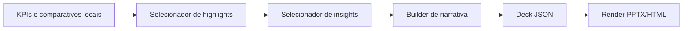

# Modulo de Geracao de Slides Executivos

Data de referencia: 2026-04-06

## 1. Decisao principal

O modulo de slides nao deve despejar metricas.

Ele deve transformar:

- KPIs agregados
- comparativos de periodo
- insights priorizados
- proximos passos

em uma narrativa curta, elegante e leiga.

### Regra central

Cada slide deve ter:

- uma mensagem principal
- poucos numeros
- um grafico ou destaque visual util
- uma conclusao simples

## 2. Estrutura ideal do deck

## 2.1 Fluxo narrativo recomendado

1. contexto e resultado geral
2. o que cresceu ou caiu
3. o que funcionou melhor
4. o que travou resultado
5. o que faremos agora

### Motivo

- segue a logica que um cliente leigo entende
- reduz jargao
- deixa claro o por que das mudancas

## 3. Quantidade ideal de slides

### Deck mensal [MVP]

- ideal: `7` slides
- minimo: `6`
- maximo recomendado: `8`

### Deck semanal [MVP]

- ideal: `5` slides
- minimo: `4`
- maximo recomendado: `6`

### Motivo

- deck muito curto parece superficial
- deck muito longo vira relatorio tecnico

## 4. Conteudo de cada slide

## 4.1 Template de deck mensal

### Slide 1. Resumo executivo

Mensagem principal:

- `Quanto investimos e qual retorno trouxemos no periodo`

Conteudo:

- investimento total
- principal resultado de negocio
- uma frase de contexto
- comparativo curto com periodo anterior

Exemplo de texto:

- `Investimos R$ 18,4 mil e geramos 243 conversoes no mes, com melhora de 17% no retorno em relacao ao periodo anterior.`

Grafico:

- nao precisa grafico grande
- usar 3 a 4 KPIs em destaque

### Slide 2. Evolucao do periodo

Mensagem principal:

- `Como o desempenho evoluiu ao longo do mes`

Conteudo:

- gasto por dia
- resultado principal por dia
- leitura curta da tendencia

Grafico:

- linha dupla ou area/linha
- `investimento` e `resultado` ou `investimento` e `valor de conversao`

### Slide 3. O que funcionou melhor

Mensagem principal:

- `Onde o investimento trouxe mais retorno`

Conteudo:

- top campanhas, regioes ou dispositivos vencedores
- no maximo 3 destaques
- por que foram vencedores em linguagem simples

Grafico:

- barras horizontais com top 3

### Slide 4. O que travou resultado

Mensagem principal:

- `Quais pontos geraram desperdicio ou seguraram crescimento`

Conteudo:

- no maximo 3 gargalos
- exemplos: mobile fraco, regiao cara, horario ruim
- explicacao curta do impacto

Grafico:

- barras comparativas ou tabela muito enxuta

### Slide 5. Diagnostico do periodo

Mensagem principal:

- `Por que certos ajustes sao necessarios`

Conteudo:

- transformar os principais insights em narrativa
- 2 ou 3 bullets claros
- ligar sintoma -> motivo provavel -> impacto

Grafico:

- opcional
- preferir destaque textual com pequenos indicadores

### Slide 6. Plano de otimizacao

Mensagem principal:

- `O que sera otimizado no proximo periodo`

Conteudo:

- 3 a 5 acoes
- cada acao com motivo simples

Formato:

- acao
- motivo
- efeito esperado

### Slide 7. Proximos passos e expectativa

Mensagem principal:

- `Como vamos acompanhar o proximo ciclo`

Conteudo:

- foco principal do proximo periodo
- o que esperamos melhorar
- observacao de risco ou dependencia, se houver

Grafico:

- normalmente nao precisa

## 4.2 Template de deck semanal

### Slide 1. Resumo da semana

Mensagem principal:

- `O que aconteceu na semana e o saldo geral`

Conteudo:

- gasto
- resultado
- variacao vs semana anterior

### Slide 2. O que puxou resultado

Mensagem principal:

- `Quais frentes ajudaram mais`

Conteudo:

- top 2 ou 3 destaques positivos

### Slide 3. O que precisa de correcao

Mensagem principal:

- `Onde houve perda de eficiencia`

Conteudo:

- top 2 ou 3 pontos de atencao

### Slide 4. Ajustes da proxima semana

Mensagem principal:

- `O que vai mudar imediatamente`

Conteudo:

- 3 a 4 acoes praticas

### Slide 5. Fechamento executivo

Mensagem principal:

- `O que esperamos do proximo ciclo`

Conteudo:

- previsao operacional curta
- proximo objetivo

## 5. O que mostrar em graficos

### Recomendado

- linha de investimento ao longo do tempo
- linha de resultado ao longo do tempo
- barras de top campanhas
- barras de top gargalos
- pizza ou barra empilhada apenas quando a mensagem for distribuicao simples

### Melhor graficos para leigos

- `linha`: evolucao
- `barra horizontal`: comparacao
- `stacked bar`: distribuicao de investimento

### Regra de ouro

Todo grafico precisa responder uma pergunta simples:

- `Como evoluiu?`
- `Quem performou melhor?`
- `Onde estamos desperdicando?`

## 6. O que evitar por ser tecnico demais

- tabelas grandes com muitas colunas
- CTR, CPC, CPA e ROAS todos no mesmo slide sem narrativa
- termos como `impression share`, `rank lost share`, `GAQL`, `tracking discrepancy`
- segmentacoes excessivas
- funis tecnicos complicados
- mais de um grafico pesado no mesmo slide
- mais de 6 numeros relevantes por slide

## 7. Como adaptar a linguagem para leigos

### Trocas recomendadas

- `CTR caiu` -> `menos pessoas clicaram proporcionalmente nos anuncios`
- `CPA subiu` -> `o custo por resultado ficou mais alto`
- `ROAS melhorou` -> `o retorno sobre o investimento melhorou`
- `queda de CVR` -> `menos visitas viraram resultado`
- `redistribuir verba` -> `mover investimento para onde performa melhor`

### Regra de escrita

- usar frases curtas
- explicar impacto antes do detalhe tecnico
- sempre responder:
  - o que aconteceu
  - por que importa
  - o que vamos fazer

## 8. Como transformar metricas em impacto de negocio

### Formula narrativa

- metrica
- traducao de negocio
- impacto

Exemplos:

- `O CPA subiu 22%`  
  vira  
  `Estamos pagando mais caro para gerar cada oportunidade, o que reduz a eficiencia do investimento.`

- `ROAS subiu de 3,2 para 4,0`  
  vira  
  `O mesmo investimento passou a trazer mais retorno financeiro.`

- `Uma regiao consumiu 18% da verba com baixo resultado`  
  vira  
  `Parte relevante do investimento foi para uma frente que nao devolveu retorno no mesmo nivel.`

## 9. Como destacar proximos passos

### Modelo recomendado

Cada proximo passo deve ter:

- `acao`
- `motivo`
- `impacto esperado`

Exemplo:

- `Reduzir exposicao em mobile`
- `porque o custo por resultado ficou acima da media`
- `para diminuir desperdicio e recuperar eficiencia`

### Regra

- no maximo 5 proximos passos por deck mensal
- no maximo 4 por deck semanal

## 10. Pipeline do modulo



### Etapas

1. buscar KPIs e comparativos locais
2. selecionar destaques positivos
3. selecionar gargalos
4. selecionar proximos passos
5. gerar narrativa por slide
6. validar limite de numeros e linguagem
7. exportar JSON do deck

## 11. Template de deck mensal

### Estrutura resumida

1. `Resumo executivo`
2. `Evolucao do periodo`
3. `O que funcionou melhor`
4. `O que travou resultado`
5. `Diagnostico do periodo`
6. `Plano de otimizacao`
7. `Proximos passos`

## 12. Template de deck semanal

### Estrutura resumida

1. `Resumo da semana`
2. `Principais ganhos`
3. `Pontos de atencao`
4. `Ajustes da proxima semana`
5. `Fechamento executivo`

## 13. Prompt para gerar o conteudo dos slides

O prompt abaixo tambem foi salvo em [executive-slides.prompt.md](C:/Users/digom/OneDrive/Documentos/GoogleADS/apps/api/src/modules/reports/domain/prompts/executive-slides.prompt.md).

```text
Voce gera conteudo para slides executivos de Google Ads destinados a clientes leigos.

Seu papel nao e fazer nova analise estatistica. Seu papel e transformar KPIs agregados, comparativos e insights ja validados em uma apresentacao curta, clara, elegante e convincente.

Regras obrigatorias:
1. Cada slide deve ter uma unica mensagem principal.
2. Evite jargao tecnico.
3. Evite excesso de numeros; use apenas os que sustentam a mensagem central.
4. Explique impacto de negocio antes de detalhe tecnico.
5. Se houver problema, explique o que travou, por que isso importa e o que sera feito.
6. Se houver incerteza ou lacuna de dado, nao invente explicacao.
7. A linguagem deve soar como apresentacao profissional de agencia.
8. Produza saida em JSON valida no schema exigido.

Estilo:
- objetivo
- elegante
- leigo
- convincente sem exagero
- com foco em proximo passo
```

Template de uso com payload:

- [executive-slides-user-template.prompt.md](C:/Users/digom/OneDrive/Documentos/GoogleADS/apps/api/src/modules/reports/domain/prompts/executive-slides-user-template.prompt.md)

## 14. Estrutura JSON do deck

O contrato foi salvo em:

- [executive-deck.ts](C:/Users/digom/OneDrive/Documentos/GoogleADS/packages/shared/src/contracts/executive-deck.ts)
- [executive-deck.schema.json](C:/Users/digom/OneDrive/Documentos/GoogleADS/packages/shared/src/contracts/executive-deck.schema.json)

### Estrutura principal

- `deck_id`
- `tenant_id`
- `client_id`
- `report_type`
- `period_reference`
- `audience`
- `headline`
- `slides`
- `generated_at`

### Regras para o JSON

- cada slide precisa ter `slide_id`, `slide_type`, `title`, `main_message`
- cada slide pode ter:
  - `bullets`
  - `highlights`
  - `chart`
  - `speaker_note`
- `slides` devem respeitar a ordem narrativa do template

### Exemplo resumido de deck JSON mensal

```json
{
  "deck_id": "deck_01JQJ7M8R4J3Y5Y0A2B1C9D7E6",
  "tenant_id": "tnt_1001",
  "client_id": "cli_204",
  "report_type": "monthly",
  "period_reference": {
    "period_label": "Marco 2026",
    "period_start": "2026-03-01",
    "period_end": "2026-03-31",
    "baseline_label": "Fevereiro 2026"
  },
  "audience": "client",
  "headline": "Marco trouxe melhora de eficiencia com espaco para otimizar mobile e horarios de baixo retorno.",
  "slides": [
    {
      "slide_id": "s1",
      "slide_type": "cover_summary",
      "title": "Resumo executivo",
      "main_message": "O investimento do mes trouxe mais resultado do que no periodo anterior.",
      "bullets": [
        "Investimos R$ 18,4 mil no periodo.",
        "Geramos 243 conversoes no mes.",
        "O retorno melhorou 17% frente ao periodo anterior."
      ],
      "highlights": [
        {
          "label": "Investimento",
          "value": "R$ 18,4 mil",
          "context": null
        },
        {
          "label": "Conversoes",
          "value": "243",
          "context": "+12% vs periodo anterior"
        }
      ],
      "chart": null,
      "speaker_note": "Abrir com saldo geral e mostrar que houve melhora, sem entrar em detalhe tecnico."
    },
    {
      "slide_id": "s2",
      "slide_type": "trend",
      "title": "Evolucao do periodo",
      "main_message": "O resultado acompanhou o crescimento do investimento com melhor eficiencia no meio do mes.",
      "bullets": [
        "O desempenho ganhou ritmo na segunda metade do periodo.",
        "Os dias de melhor retorno coincidiram com campanhas mais eficientes."
      ],
      "highlights": [],
      "chart": {
        "chart_type": "line",
        "title": "Investimento e resultado ao longo do mes",
        "x_label": "Dia",
        "y_label": null,
        "series": [
          {
            "name": "Investimento",
            "points": [
              { "label": "01/03", "value": 520 },
              { "label": "15/03", "value": 640 },
              { "label": "31/03", "value": 590 }
            ]
          },
          {
            "name": "Conversoes",
            "points": [
              { "label": "01/03", "value": 6 },
              { "label": "15/03", "value": 9 },
              { "label": "31/03", "value": 8 }
            ]
          }
        ]
      },
      "speaker_note": "Mostrar tendencia, nao microvariacao diaria."
    }
  ],
  "generated_at": "2026-04-06T12:00:00Z"
}
```

## 15. Persistencia recomendada

### MVP

Persistir o deck JSON em:

- `executive_reports.summary_json`

Persistir arquivo renderizado em:

- `executive_reports.storage_path`

### Depois

Se quiser historico por slide:

- adicionar `executive_report_slides`

## 16. Recomendacao final

### MVP

- deck mensal de 7 slides
- deck semanal de 5 slides
- JSON canonico do deck
- prompt controlado
- render para PPTX ou HTML

### Recomendado

- validador para limitar jargao
- validador para limitar numeros por slide
- fallback por template quando a IA exagerar ou fugir do schema
