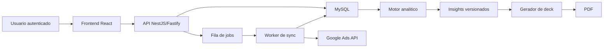

# PRD - SaaS Multi-tenant de Analise, Insights e Relatorios Google Ads

Data de referencia: 2026-04-06
Status: draft consolidado para desenvolvimento
Stack alvo: Node.js + TypeScript

## 1. Visao do produto

Construir uma plataforma SaaS multi-tenant para agencias e gestores de trafego pago que centraliza dados de Google Ads, sincroniza metricas de forma agendada, armazena tudo em banco proprio, analisa performance com regras de negocio e gera dashboards e apresentacoes executivas para clientes.

O produto deve operar com a regra `local-first`:

- dashboards leem apenas de banco local, cache e agregados
- a Google Ads API e usada somente por jobs controlados
- toda recomendacao deve ser explicavel e auditavel

## 2. Problema que resolve

Agencias e gestores de trafego normalmente enfrentam estes problemas:

- dependencia de leitura manual no Google Ads
- dashboards lentos ou caros porque consultam a API em tempo real
- relatorios recorrentes feitos manualmente em planilhas ou slides
- dificuldade de explicar resultado para clientes leigos
- pouca padronizacao na analise de horario, regiao, dispositivo, campanha e termos
- risco de bloqueio, throttling ou alto consumo da API
- risco operacional e de seguranca ao concentrar multiplos clientes em um unico ambiente sem isolamento forte

O produto resolve isso ao transformar a operacao em um fluxo padronizado:

1. conectar contas Google Ads com seguranca
2. sincronizar dados sob demanda controlada
3. salvar fatos e agregados locais
4. detectar sintomas e recomendar acoes
5. gerar narrativa tecnica e executiva
6. entregar dashboards e slides sem depender da API em tempo real

## 3. Publico-alvo

### Primario

- agencias de trafego pago com multiplos clientes
- gestores de trafego que operam varias contas Google Ads

### Secundario

- analistas de performance que precisam investigar gargalos
- donos de agencia que precisam de visao consolidada
- clientes finais que querem uma leitura simples do resultado

### Perfis de uso

- `superadmin`: operacao da plataforma
- `agency_admin`: administra o tenant da agencia
- `manager`: acompanha clientes, aprova acoes e interpreta insights
- `analyst`: analisa performance e opera rotinas tecnicas
- `client_viewer`: consulta dashboards e relatorios

## 4. Proposta de valor

### Para a agencia

- centraliza clientes e contas Google Ads em um unico ambiente
- reduz tempo gasto com relatorios manuais
- melhora padronizacao analitica entre gestores
- reduz custo operacional e dependencia da API em tempo real

### Para o gestor

- mostra o que piorou, por que piorou e o que fazer
- prioriza problemas por impacto e confianca
- facilita diagnostico por horario, regiao, dispositivo, campanha e termos

### Para o cliente final

- traduz metricas tecnicas em impacto de negocio
- apresenta resultado em linguagem clara
- mostra proximos passos com justificativa simples

## 5. Escopo do MVP

### Objetivo do MVP

Entregar uma primeira versao usavel por uma agencia com varios clientes, com seguranca forte, ingestao confiavel, dashboards locais e relatorio executivo automatizado.

### Incluido no MVP

- autenticacao da plataforma com sessao server-side
- multi-tenant com isolamento por `tenant_id`
- perfis `superadmin`, `agency_admin`, `manager`, `analyst`, `client_viewer`
- OAuth do Google para conectar contas Google Ads
- descoberta de contas Google Ads conectadas
- sincronizacao inicial e incremental agendada
- reprocessamento de janelas recentes para conversoes atrasadas
- persistencia local em MySQL com dimensoes, fatos e agregados
- dashboards `local-first`
- filtros por periodo, conta, campanha, dispositivo, horario e regiao
- indicadores de recencia e saude da sincronizacao
- motor analitico deterministico inicial
- insights com prioridade, confianca e explicacao tecnica e executiva
- geracao de deck executivo em `HTML/CSS -> PDF`
- auditoria funcional e eventos de seguranca
- logs estruturados e mascarados
- fila com prioridade e retries controlados

### Fora do MVP

- dependencia da Google Ads API em tempo real na UI
- edicao colaborativa de slides dentro da plataforma
- suporte multi-canal alem de Google Ads
- automacao de alteracoes direto na conta Google Ads
- warehouse dedicado
- banco por tenant
- PPTX editavel como formato principal

## 6. Escopo pos-MVP

- renderer adicional de `PPTX` programatico
- search terms com cobertura mais ampla
- analise mais profunda por keyword e anuncio
- scorecards de budget pacing
- regras analiticas mais avancadas por funil e landing page
- camada de IA explicativa com fallback validado
- templates de relatorio por agencia e por cliente
- exportacoes adicionais e sharing controlado
- observabilidade mais forte com dashboards operacionais
- isolamento enterprise com banco por tenant, se necessario

## 7. Requisitos funcionais

### RF-01. Cadastro e autenticacao

O sistema deve permitir login com `email + senha`, sessao server-side, logout, recuperacao de senha e MFA para perfis sensiveis.

### RF-02. Multi-tenant

O sistema deve permitir multiplas agencias em um mesmo ambiente, com isolamento total de dados entre tenants.

### RF-03. Gestao de usuarios

O sistema deve permitir cadastrar usuarios por tenant, atribuir papeis e restringir acesso por cliente quando necessario.

### RF-04. Conexao Google Ads

O sistema deve permitir conectar contas Google Ads por OAuth, armazenar credenciais com seguranca e listar contas acessiveis.

### RF-05. Descoberta de contas

Apos a conexao OAuth, o sistema deve descobrir e registrar contas Google Ads associadas ao tenant e ao cliente correto.

### RF-06. Sincronizacao inicial

O sistema deve executar sincronizacao inicial por conta com janela historica configuravel e checkpoint por escopo.

### RF-07. Sincronizacao incremental

O sistema deve sincronizar periodicamente dados novos ou alterados sem depender de consulta online pelo usuario.

### RF-08. Reprocessamento recente

O sistema deve reprocessar janelas recentes para corrigir conversoes atrasadas e inconsistencias temporarias.

### RF-09. Fila e prioridade

O sistema deve enfileirar jobs de sincronizacao, agregacao, insights e relatorios com prioridade, deduplicacao e retomada apos falha.

### RF-10. Persistencia local

O sistema deve armazenar fatos diarios e intradiarios, dimensoes Google Ads, agregados e metadados de sincronizacao.

### RF-11. Dashboards

O sistema deve exibir dashboards a partir de dados locais, com filtros por periodo, conta, campanha, dispositivo, horario e regiao.

### RF-12. Recencia e integridade

O sistema deve mostrar `ultima sincronizacao`, `status da sync`, `dados parciais` e `falhas recentes`.

### RF-13. Sync manual controlada

O usuario autorizado deve poder solicitar nova sincronizacao manual, que entra em fila sem disparar consulta imediata na UI.

### RF-14. Motor analitico

O sistema deve detectar sintomas, levantar hipoteses provaveis e sugerir acoes com base em regras deterministicas e evidencias locais.

### RF-15. Insights versionados

O sistema deve gerar insights padronizados em JSON, com prioridade, confianca, evidencia, diagnostico, acao sugerida e versionamento.

### RF-16. Explicacao tecnica e executiva

O sistema deve gerar duas narrativas para cada insight relevante:

- versao tecnica para gestor
- versao simplificada para cliente

### RF-17. Relatorios executivos

O sistema deve gerar decks executivos curtos, elegantes e compreensiveis para clientes leigos.

### RF-18. Exportacao

O sistema deve permitir exportar relatorios autorizados em PDF no MVP.

### RF-19. Auditoria

O sistema deve registrar login, logout, falhas, conexao Google Ads, token refresh, sincronizacao, insights, relatorios, exportacoes e mudancas administrativas.

### RF-20. Observabilidade operacional

O sistema deve registrar logs tecnicos, logs de auditoria, eventos de seguranca, status de jobs e correlacao por `request_id` e `correlation_id`.

## 8. Requisitos nao funcionais

### RNF-01. Seguranca

- nenhum token ou secret no frontend
- secrets apenas em variaveis de ambiente
- refresh tokens criptografados em repouso
- cookies `HttpOnly`, `Secure`, `SameSite`
- protecao contra `SQL injection`, `XSS`, `CSRF`, `IDOR`, brute force e enumeracao

### RNF-02. Isolamento

- toda tabela de negocio deve carregar `tenant_id`
- toda leitura deve filtrar por `tenant_id`
- cache, exportacao e auditoria tambem devem respeitar escopo de tenant

### RNF-03. Performance

- dashboard principal deve responder a partir de agregados locais
- leituras pesadas devem usar cache e agregados precomputados
- jobs pesados nao podem competir com o request web

### RNF-04. Confiabilidade

- scheduler e workers devem tolerar falhas e retomada
- checkpoint so avanca apos persistencia bem-sucedida
- filas devem suportar retries com backoff exponencial e dead letter

### RNF-05. Compatibilidade com hosting simples

- arquitetura deve rodar em VPS simples na Hostinger
- banco principal em MySQL 8
- cron do sistema ou painel da hospedagem deve ser suficiente para o scheduler

### RNF-06. Manutenibilidade

- TypeScript estrito
- codigo modular
- contratos compartilhados entre backend e frontend
- logs e erros padronizados

### RNF-07. Observabilidade

- logs estruturados em JSON
- mascaramento de dados sensiveis
- metadados de sincronizacao e auditoria consultaveis

### RNF-08. Backup e restore

- rotina de backup do banco e artefatos de relatorio
- restore deve preservar integridade de tenants, auditoria e versoes de insight

## 9. Arquitetura resumida

### Stack alvo

- `Backend`: NestJS + Fastify + TypeScript
- `Frontend`: React + Vite + TypeScript
- `ORM`: Prisma
- `Banco`: MySQL 8
- `Filas no MVP`: MySQL-based queue
- `Jobs`: cron + worker dedicado
- `Relatorios MVP`: HTML/CSS -> PDF

### Modulos principais do backend

- `auth`
- `tenancy`
- `users`
- `clients`
- `google-ads`
- `sync`
- `analytics`
- `insights`
- `reports`
- `audit`
- `health`

### Fluxo resumido

### Principios de arquitetura

- `local-first`: UI nunca depende da API Google Ads em tempo real
- `multi-tenant by design`: isolamento obrigatorio em todas as camadas
- `jobs-first`: sync, agregacao, insights e relatorios rodam assincronamente
- `explainable analytics`: recomendacoes devem nascer de evidencias e regras

## 10. Regras de seguranca

- autenticacao da plataforma separada do OAuth Google Ads
- sessao server-side como modelo principal de autenticacao web
- MFA obrigatorio para `superadmin` e `agency_admin`
- secrets somente em variaveis de ambiente
- refresh tokens e segredos criptografados com `AES-256-GCM` ou equivalente
- senhas protegidas com `Argon2id` ou equivalente forte
- trilha de auditoria append-only para eventos criticos
- mascaramento de `access_token`, `refresh_token`, `client_secret`, `developer_token`, cookies e headers sensiveis
- validacao obrigatoria de tenant em middleware, service e query
- checagem de autorizacao por papel e por escopo de cliente
- rate limit interno por usuario e por tenant
- exportacao restrita por permissao
- `support mode` auditado para acesso excepcional de `superadmin`
- todo trafego via HTTPS em staging e producao

## 11. Estrategia de ingestao de dados

### Principio

Sincronizar de forma agendada, incremental, idempotente e com baixo risco de quota ou throttling.

### Sincronizacao inicial

- `account_daily` e `campaign_daily`: ultimos 90 dias em blocos de 30 dias
- `device`, `hour`, `geo`: ultimos 30 dias em blocos de 7 dias
- `search_terms`: opcional no MVP, limitado a 7 a 14 dias e somente quando habilitado

### Sincronizacao incremental

- `intraday leve`: a cada 2 horas, somente `TODAY`, para `account` e `campaign`
- `sync diario completo`: entre 02:00 e 04:00 no timezone da conta para `YESTERDAY`
- `agregacoes`: apos a sync completa, recalcular agregados e caches

### Reprocessamento

- reprocessar ultimos 14 dias para `account` e `campaign`
- reprocessar ultimos 3 dias para `device`, `hour` e `geo`
- reprocessar janelas maiores semanalmente quando necessario

### Jobs por granularidade

- `account_discovery`
- `daily_account`
- `intraday_account`
- `daily_campaign`
- `intraday_campaign`
- `daily_campaign_device`
- `daily_campaign_hour`
- `daily_campaign_geo`
- `daily_search_term` pos-MVP ou seletivo
- `aggregate_client_kpis`
- `generate_insights`
- `generate_executive_report`

### Tabelas de controle

- `sync_jobs`
- `sync_runs`
- `sync_checkpoints`
- `api_request_logs`
- `dead_letter_queue`

### Regras operacionais

- checkpoint so avanca depois do commit no banco
- jobs tem `dedupe_key` para evitar duplicidade
- retries com backoff exponencial e jitter
- falhas permanentes vao para `dead_letter_queue`
- concorrencia inicial conservadora para proteger quota

## 12. Estrategia analitica

### Objetivo

Transformar metricas em diagnostico e recomendacao, e nao apenas em visualizacao.

### Camadas do motor analitico

1. `Feature Builder`
2. `Comparator Engine`
3. `Symptom Detectors`
4. `Hypothesis Mapper`
5. `Action Recommender`
6. `Priority and Confidence Scoring`
7. `Explanation Builder`

### Regras iniciais do MVP

- analise por horario
- analise por regiao
- analise por dispositivo
- diagnosticos de `CPA`, `CTR`, `CVR`, `ROAS`, share de gasto e share de valor
- priorizacao de campanhas para escalar, reduzir ou pausar

### Regras de qualidade analitica

- nunca afirmar causa sem evidencia suficiente
- diferenciar `sintoma`, `hipotese principal` e `acao sugerida`
- quando faltar dado, declarar explicitamente
- usar amostra minima antes de recomendar corte ou escala

### Janelas de comparacao

- `ontem vs anteontem` para alerta rapido
- `ultimos 7 dias`
- `ultimos 14 dias`
- `ultimos 30 dias`

### Saida padronizada

Cada insight deve carregar:

- `titulo`
- `entidade afetada`
- `evidencias`
- `diagnostico`
- `hipotese principal`
- `hipoteses alternativas`
- `acao recomendada`
- `impacto esperado`
- `prioridade`
- `confianca`
- `versao tecnica`
- `versao executiva`

## 13. Geracao de slides executivos

### Objetivo

Converter resultado tecnico em uma apresentacao curta, clara e profissional para cliente leigo.

### Regras do modulo

- cada slide deve comunicar uma mensagem principal
- evitar jargao e excesso de numeros
- destacar impacto de negocio e proximos passos
- usar dados locais e insights validados

### Formato recomendado no MVP

- `HTML/CSS -> PDF`

### Formato recomendado no longo prazo

- `deck JSON canonico + renderer PDF + renderer PPTX`

### Deck mensal do MVP

- capa e resumo executivo
- resultado geral do periodo
- tendencias principais
- o que funcionou melhor
- o que travou resultado
- o que sera otimizado
- proximos passos e expectativa

### Deck semanal do MVP

- resumo da semana
- principais ganhos e perdas
- alertas e gargalos
- acoes da proxima semana
- fechamento executivo

## 14. Permissoes e perfis

### `superadmin`

- administra a plataforma
- nao participa do tenant por padrao
- acesso excepcional a tenants somente em `support mode` auditado

### `agency_admin`

- administra usuarios, clientes, configuracoes do tenant e conexoes
- pode disparar sync manual e gerar relatorios

### `manager`

- consulta dashboards, insights e relatorios
- pode solicitar sync manual e operar clientes permitidos

### `analyst`

- consulta dados e insights
- pode investigar performance e gerar relatorios operacionais
- acesso limitado por cliente quando aplicavel

### `client_viewer`

- acesso somente leitura ao proprio cliente
- pode ver dashboards e relatorios permitidos
- nao pode ver configuracoes, auditoria ou outros clientes

### Escopo de autorizacao

- `platform scope`: apenas `superadmin`
- `tenant scope`: usuarios da agencia
- `client scope`: subconjunto de clientes autorizados ao usuario

## 15. Roadmap

### Fase 0. Fundacao tecnica

- monorepo Node.js + TypeScript
- auth, tenancy, usuarios, clients
- schema inicial e migracoes
- observabilidade minima

### Fase 1. MVP operacional

- OAuth Google Ads
- descoberta de contas
- sync inicial e incremental
- dashboards locais
- auditoria e eventos de seguranca

### Fase 2. MVP analitico

- motor analitico inicial
- insights versionados
- explicacao tecnica e executiva
- deck semanal e mensal em PDF

### Fase 3. Robustez operacional

- otimizacao de agregados
- melhorias de fila e retry
- melhorias de auditoria e observabilidade
- templates por agencia

### Fase 4. Expansao

- renderer PPTX
- search terms ampliado
- IA explicativa validada
- features enterprise

## 16. Riscos

### Risco 1. Quota e throttling da Google Ads API

Mitigacao:

- sync agendada
- janelas incrementais
- concorrencia conservadora
- retries com backoff

### Risco 2. Vazamento entre tenants

Mitigacao:

- `tenant_id` em todas as tabelas relevantes
- validacao em middleware e service
- testes anti-vazamento
- auditoria de acesso

### Risco 3. Conversoes atrasadas gerando leitura incorreta

Mitigacao:

- reprocessamento de janelas recentes
- indicadores de recencia e parcialidade

### Risco 4. Crescimento de volume no banco

Mitigacao:

- fatos no grao certo
- agregados precomputados
- retencao e arquivamento de dados intradiarios

### Risco 5. Relatorios com narrativa ruim ou tecnica demais

Mitigacao:

- deck com estrutura fixa
- linguagem executiva controlada
- validador final de consistencia

### Risco 6. Complexidade excessiva cedo demais

Mitigacao:

- manter MVP com queue em MySQL
- PDF antes de PPTX
- regras deterministicas antes de IA mais livre

## 17. Criterios de aceite

### CA-01. Multi-tenant

- um usuario de um tenant nao consegue acessar dados de outro tenant em nenhuma rota ou exportacao

### CA-02. Autenticacao e autorizacao

- login, logout, expiracao de sessao, MFA de perfis sensiveis e RBAC funcionam conforme perfil

### CA-03. Conexao Google Ads

- usuario autorizado consegue conectar uma conta, registrar o acesso e listar contas disponiveis sem expor tokens

### CA-04. Sync inicial

- apos conectar uma conta, o sistema consegue popular fatos diarios basicos e registrar checkpoints

### CA-05. Sync incremental

- jobs recorrentes atualizam dados sem duplicar registros e retomam corretamente apos falha

### CA-06. Dashboard local-first

- dashboards funcionam apenas com dados locais, exibem ultima sincronizacao e nao dependem da Google Ads API em tempo real

### CA-07. Integridade da sync

- usuario consegue ver status da fila, falhas recentes e recencia dos dados por conta e por escopo

### CA-08. Insights

- o sistema gera insights com prioridade, confianca, evidencia, diagnostico e acao recomendada

### CA-09. Explicacao

- cada insight relevante possui versao tecnica e versao executiva coerentes com as evidencias

### CA-10. Relatorio executivo

- o sistema gera deck semanal e mensal em PDF com visual profissional, linguagem leiga e proximos passos claros

### CA-11. Auditoria

- eventos criticos de autenticacao, sincronizacao, relatorios e mudancas administrativas sao registrados e consultaveis

### CA-12. Seguranca

- nenhum secret aparece no frontend, em logs nao mascarados ou em exportacoes indevidas

### CA-13. Operacao em hosting simples

- web app, scheduler e worker podem ser executados em VPS simples com MySQL e cron

## 18. Decisao final de produto

O produto deve nascer como um SaaS `local-first`, multi-tenant e seguro, focado em Google Ads, com o seguinte posicionamento:

- nao e apenas dashboard
- nao e apenas conector de API
- nao e apenas gerador de relatorio

Ele deve ser uma camada operacional e analitica para agencias:

- coleta com seguranca
- organiza com performance
- interpreta com criterio
- comunica com clareza

Esse escopo e suficiente para iniciar desenvolvimento real do MVP com backlog tecnico e funcional.
